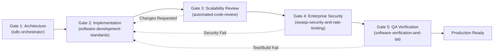
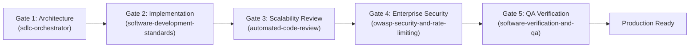

# Comprehensive Architecture & Antigravity Compatibility Audit Report

**Investigator**: `explorer_sdlc_arch`  
**Date**: 2026-08-18  
**Scope**: Requirement R1 — Skill Architecture, Antigravity Customization Standards, Plugin Manifests, Rulebooks, and Subagent Registries  
**Target Root Paths**:
- Global Plugin: `/home/sahar/.gemini/config/plugins/agentic-sdlc-framework/`
- Workspace Rules & Skills: `/home/sahar/Deliveree/AGENTS.md`, `/home/sahar/Deliveree/.agents/subagents/subagents.json`, `/home/sahar/Deliveree/.agents/skills/*`

---

## 1. Executive Summary & Antigravity Compatibility Assessment

The **Autonomous Multi-Agent SDLC Framework** provides a high-discipline, hardware/ASIC-inspired 5-stage software engineering pipeline (Orchestrator $\rightarrow$ Developer $\rightarrow$ Code Reviewer $\rightarrow$ Security Auditor $\rightarrow$ QA Verifier). However, an adversarial architectural evaluation against official **Antigravity Customization Standards** (`agy-customizations`) reveals significant structural limitations, synchronization divergences, and opportunities for token-efficient optimization.

### Overall Antigravity Standards Scorecard

| Architectural Pillar | Evaluation Criteria | Current Status | Key Vulnerability / Defect |
| :--- | :--- | :---: | :--- |
| **Pillar 1: YAML Frontmatter & Routing** | Valid `name`, descriptive third-person `description`, explicit triggers, "Use when" / "Do NOT use when" guardrails, I/O contracts. | **PARTIAL / DEFICIENT** | All 6 skills lack explicit "Use when / Do NOT use when" negative routing triggers and input/output schema definitions. |
| **Pillar 2: Progressive Disclosure** | Monolithic `SKILL.md` avoidance; modular segregation into `references/`, `resources/`, `scripts/`, `examples/`. | **NON-COMPLIANT** | Zero skills utilize subdirectories. 100% of text is dumped directly into `SKILL.md`, causing unnecessary token overhead upon activation. |
| **Pillar 3: Instruction Hierarchies & Imperatives** | Prescriptive, imperative step-by-step guidance; crisp subagent role personas; unambiguous error remediation loops. | **MODERATE** | Instructions alternate between passive descriptions and imperative steps. Subagent invocation patterns diverge between plugin and workspace. |
| **Pillar 4: Execution Checklists & Tooling** | Copy-pasteable verification commands, portable script paths, structured JSON/Markdown output templates, sandbox permissions. | **DEFICIENT** | Hardcoded `file:///` URLs in `AGENTS.md` and `remote-notifications-and-chat`; missing script portability; missing tool permission declarations in `subagents.json`. |

---

## 2. Cross-Artifact Synchronization & Divergence Audit

A critical architectural flaw in the current framework is the **split-brain divergence** between global plugin definitions (`~/.gemini/config/plugins/agentic-sdlc-framework/`) and workspace-local mirrors (`/home/sahar/Deliveree/.agents/`):

```
┌─────────────────────────────────────────────────────────┐
│ GLOBAL PLUGIN (~/.gemini/config/plugins/...)             │
│ - plugin.json: Declares 5 core skills                   │
│ - rules/sdlc_pipeline.md: Lists Gates 1-5 inline        │
│ - skills/: 5 skill directories                          │
│   ❌ MISSING: remote-notifications-and-chat             │
│   ❌ Invocation: "Activate the <skill> skill"           │
└────────────────────────────┬────────────────────────────┘
                             │  Divergence / Drift
┌────────────────────────────▼────────────────────────────┐
│ WORKSPACE-LEVEL (/home/sahar/Deliveree/...)             │
│ - AGENTS.md: Lists 6 skills with absolute file:/// URLs │
│ - .agents/subagents/subagents.json: Defines 4 subagents │
│ - .agents/skills/: 6 skill directories (incl. remote)   │
│   ⚠️ Invocation: "TypeName: developer" + Role persona   │
└─────────────────────────────────────────────────────────┘
```

### Specific Synchronization Divergences:
1. **Missing 6th Skill in Global Plugin**:
   - `remote-notifications-and-chat` exists in `/home/sahar/Deliveree/.agents/skills/remote-notifications-and-chat/SKILL.md` and is registered in `AGENTS.md:84`, but is **completely absent** from `/home/sahar/.gemini/config/plugins/agentic-sdlc-framework/skills/`.
   - *Impact*: Any project relying on the global plugin without workspace-level overrides will fail to discover the remote notification and Telegram bridge capabilities.
2. **Subagent Invocation Protocol Clash**:
   - `sdlc-orchestrator/SKILL.md` (Plugin lines 32, 47, 61, 75) instructs the Orchestrator to prompt subagents with `Activate the <skill-name> skill`.
   - `sdlc-orchestrator/SKILL.md` (Workspace lines 26-82) specifies explicit subagent dispatch templates with `Role: Feature Developer`, `TypeName: developer`, and `You are the Feature Developer.` matching `subagents.json`.
3. **Rulebook Discrepancy**:
   - `rules/sdlc_pipeline.md` (Plugin lines 31-66) embeds skill names inside the Gate headings (`* **Skill**: sdlc-orchestrator`), but does not have Section 4 skill discovery links.
   - `AGENTS.md` (Workspace lines 76-85) decouples skill discovery into Section 4 using `file:///` absolute paths (`file:///home/sahar/Deliveree/.agents/skills/...`).

---

## 3. Systematic Line-Cited Artifact Critiques

---

### Artifact 1: `plugin.json` (Plugin Manifest)
**Path**: `/home/sahar/.gemini/config/plugins/agentic-sdlc-framework/plugin.json`  
**Current Content**:
```json
1: {
2:   "name": "agentic-sdlc-framework",
3:   "version": "1.0.0",
4:   "description": "Enterprise Multi-Agent SDLC Framework with Project Manager Orchestrator, Clean Architecture Developers, Scalability Reviewers, OWASP ASVS Level 3 Security Auditors, and QA Verification.",
5:   "author": {
6:     "name": "Sahar"
7:   },
8:   "license": "Apache-2.0"
9: }
```

#### Line-by-Line Critique:
- **Lines 1–9**: The manifest contains only minimal basic metadata.
- **Missing Skills Packaging**: The manifest does not declare the `skills` collection or bundled assets. Because `remote-notifications-and-chat` was omitted from the folder, the plugin is incomplete.
- **Missing Tool & Sandbox Requirements**: Antigravity plugins supporting terminal operations and network alerting require permissions declarations (e.g. `run_command` with network access for Telegram/SMTP alerting).
- **Missing Categorization & Keywords**: Lacks `keywords`, `engines` compatibility, and repository links for enterprise plugin indexing.

---

### Artifact 2: `sdlc_pipeline.md` (Plugin Rulebook)
**Path**: `/home/sahar/.gemini/config/plugins/agentic-sdlc-framework/rules/sdlc_pipeline.md`

#### Line-by-Line Critique:
- **Lines 1–4**:
  > `1: # Autonomous Multi-Agent SDLC Framework Rulebook`  
  > `3: When performing software development, architecture planning, code reviews, or verification across any project, follow the **Autonomous Multi-Agent SDLC Framework**.`
  - *Critique*: Lacks frontmatter metadata. Standalone rulebooks in plugins benefit from context triggers to prevent injecting the entire 78-line rulebook when operating in unrelated non-code contexts.
- **Lines 22–29 (Mermaid Diagram)**:
  - *Critique*: Clean visualization of the 5-stage sequential pipeline, but lacks the backward failure/remediation loop (e.g., Gate 3/4/5 rejection returning to Gate 2).
- **Lines 31–66 (Gate Definitions)**:
  - *Critique*: Lines 32, 38, 44, 50, 62 declare `* **Skill**: <name>`. However, there is no guidance on how the agent coordinates subagent lifecycles or writes persistent artifacts (`BRIEFING.md`, `progress.md`, `handoff.md`).
- **Lines 69–78 (Sign-Off Criteria)**:
  - *Critique*: The 6 criteria are strong non-negotiables, but lack formal verification mechanisms (e.g., specific exit codes, test coverage metrics, or automated AST scanning tools).

---

### Artifact 3: `sdlc-orchestrator` (`SKILL.md`)
**Path**: `/home/sahar/.gemini/config/plugins/agentic-sdlc-framework/skills/sdlc-orchestrator/SKILL.md`

#### Line-by-Line Critique:
- **Lines 1–4 (YAML Frontmatter)**:
  ```yaml
  1: ---
  2: name: sdlc-orchestrator
  3: description: Master orchestration guide for Project Managers and Lead Agents. Decomposes tasks into sub-tasks, establishes API contracts, coordinates subagent lifecycles (Developer -> Reviewer -> Security Auditor -> QA Verifier), and manages quality gates.
  4: ---
  ```
  - *Critique (Pillar 1)*: Frontmatter description does not define "Use when" vs "Do NOT use when" guidance. Missing input contract (requirements, scope) and output contract (work breakdown, task dispatches).
- **Lines 12–21 (Orchestrator Responsibilities)**:
  - *Critique (Pillar 3)*: High-level overview lacks a structured 4-phase execution lifecycle (1. Ingestion & Contract Definition $\rightarrow$ 2. Subagent Delegation $\rightarrow$ 3. Gate Verification & Feedback Loops $\rightarrow$ 4. Synthesis & User Sign-Off).
- **Lines 28–82 (Subagent Invocation Templates)**:
  - *Critique (Pillar 4)*: Prompts provide good guidelines, but lack structured JSON handoff schemas, output artifact paths (`.agents/<subagent_folder>/report.md`), and timeout/retry constraints.
- **Lines 86–92 (Handling Gate Rejections)**:
  - *Critique (Pillar 3)*: Lacks a bounded iteration limit (e.g. max 3 remediation cycles before user escalation) and does not integrate the Telegram/Email bridge for urgent user decisions.
- **Progressive Disclosure Defect (Pillar 2)**: Missing `references/` directory containing detailed subagent schemas, project tracking templates, and task decomposition rubrics.

---

### Artifact 4: `software-development-standards` (`SKILL.md`)
**Path**: `/home/sahar/.gemini/config/plugins/agentic-sdlc-framework/skills/software-development-standards/SKILL.md`

#### Line-by-Line Critique:
- **Lines 1–4 (YAML Frontmatter)**:
  ```yaml
  1: ---
  2: name: software-development-standards
  3: description: Best practices and engineering standards for software development. Covers Clean Architecture, separation of concerns, defensive typing, error boundaries, state management, and co-locating unit tests.
  4: ---
  ```
  - *Critique (Pillar 1)*: Description is a passive topic summary. Needs explicit trigger verbs: "Use when implementing features, writing domain logic, refactoring services, writing unit tests. Do NOT use for high-level project management or security auditing."
- **Lines 14–28 (Separation of Concerns & Clean Code)**:
  - *Critique (Pillar 3)*: Explains 3 tiers (Presentation, Business, Data), but lacks concrete file naming conventions, import boundary enforcement (e.g., UI layer must never import Data services directly without a custom hook/adapter), and dependency inversion patterns.
- **Lines 31–46 (Defensive Programming & Error Handling)**:
  - *Critique (Pillar 3)*: Provides TypeScript `AppError` interface (lines 36–42), but lacks guidelines on error status mapping, user-facing error localization, and fallback UI state machines.
- **Lines 56–64 (Automated Testing Requirements)**:
  - *Critique (Pillar 4)*: Mentions co-location and edge cases, but lacks copy-pasteable unit test boilerplate, mocking patterns for fetch/storage, and assertion guidelines for asynchronous operations.
- **Progressive Disclosure Defect (Pillar 2)**: All rules reside in a 64-line file. Lacks `references/clean_architecture_patterns.md`, `references/error_handling_guide.md`, and `examples/service_template.ts`.

---

### Artifact 5: `automated-code-review` (`SKILL.md`)
**Path**: `/home/sahar/.gemini/config/plugins/agentic-sdlc-framework/skills/automated-code-review/SKILL.md`

#### Line-by-Line Critique:
- **Lines 1–4 (YAML Frontmatter)**:
  ```yaml
  1: ---
  2: name: automated-code-review
  3: description: Comprehensive peer review and scalability checklist for evaluating code deltas. Focuses on Big-O algorithmic complexity, memory leak prevention, async safety, N+1 queries, modularity, and test coverage.
  4: ---
  ```
  - *Critique (Pillar 1)*: Missing input/output contracts (input: git diff/files; output: structured review verdict) and negative routing triggers ("Do NOT use for OWASP security audits or test execution").
- **Lines 16–23 (Algorithmic Complexity & Allocation Efficiency)**:
  - *Critique (Pillar 3)*: Identifies critical real-world antipatterns (`array.map()` containing `find()`, multiple redundant `.filter()`, `Intl.DateTimeFormat` recreation). However, it lacks a formal Big-O budget table and code examples of before/after refactorings.
- **Lines 24–34 (React State Lifecycle & Data Persistence)**:
  - *Critique (Pillar 3)*: Good coverage of `useMemo`, `useCallback`, unmount cleanup, and `QuotaExceededError`. However, it lacks guidance on React 19 Actions, Server Components vs Client Components, and asynchronous state synchronization.
- **Lines 37–45 (Bi-Directional RTL/LTR & Theming)**:
  - *Critique (Pillar 3)*: Excellent rules on logical CSS (`ltr:left rtl:right`), `<bdi>`, and WCAG AA contrast. Needs explicit instructions on testing with RTL layout engines and CSS logical properties (`margin-inline-start`, `inset-inline-start`).
- **Lines 48–68 (Structured Review Output Template)**:
  - *Critique (Pillar 4)*: Output template is structured, but lacks severity taxonomy (Critical, High, Medium, Low, Polish) and concrete line-citing syntax rules.
- **Progressive Disclosure Defect (Pillar 2)**: Missing `references/complexity_antipatterns.md` and `references/react_lifecycle_guide.md`.

---

### Artifact 6: `owasp-security-and-rate-limiting` (`SKILL.md`)
**Path**: `/home/sahar/.gemini/config/plugins/agentic-sdlc-framework/skills/owasp-security-and-rate-limiting/SKILL.md`

#### Line-by-Line Critique:
- **Lines 1–4 (YAML Frontmatter)**:
  ```yaml
  1: ---
  2: name: owasp-security-and-rate-limiting
  3: description: Strictest enterprise security auditing protocol based on OWASP ASVS Level 3 and OWASP API Top 10. Audits for BOLA/BFLA, Zero-Trust auth, rate limiting (sliding window/token bucket), defensive parsing, Anti-ReDoS, SSRF, security headers, and secret leakage.
  4: ---
  ```
  - *Critique (Pillar 1)*: Lacks explicit "Use when" / "Do NOT use when" guidance and structured I/O contract.
- **Lines 14–24 (Authorization & BOLA/BFLA)**:
  - *Critique (Pillar 3)*: Focuses specifically on Firestore update security rules (lines 18–23). While this Firestore rule is accurate and critical, the skill lacks enterprise authorization guidelines for SQL/PostgreSQL (Row-Level Security), REST APIs (tenant isolation middleware), and GraphQL query depth limiting.
- **Lines 25–28 (Anti-ReDoS & Regex Backtracking)**:
  - *Critique (Pillar 3)*: Good theoretical warning against adjacent unanchored quantifiers, but lacks an actionable scanning command or checklist of known catastrophic regex patterns (e.g. email, URL, phone validators).
- **Lines 29–35 (Native & Web APIs - Clipboard & FileReader)**:
  - *Critique (Pillar 3)*: Excellent edge-case coverage for browser clipboard permissions and memory DOS via `FileReader`. Needs expansion to WebSockets, Service Workers, and LocalStorage encryption.
- **Lines 40–44 (Rate Limiting & Resource Exhaustion)**:
  - *Critique (Pillar 4)*: Mentions dual-key throttling and HTTP 429 Retry-After, but lacks concrete algorithmic specifications (Sliding Window Log vs Token Bucket algorithms and Redis key formatting).
- **Lines 51–70 (Structured Security Audit Report)**:
  - *Critique (Pillar 4)*: Needs formal CWE/CVSS scoring metadata and exact remediation diff format.
- **Progressive Disclosure Defect (Pillar 2)**: Missing `references/asvs_l3_checklist.md`, `references/anti_redos_catalog.md`, and `references/security_headers_guide.md`.

---

### Artifact 7: `software-verification-and-qa` (`SKILL.md`)
**Path**: `/home/sahar/.gemini/config/plugins/agentic-sdlc-framework/skills/software-verification-and-qa/SKILL.md`

#### Line-by-Line Critique:
- **Lines 1–4 (YAML Frontmatter)**:
  ```yaml
  1: ---
  2: name: software-verification-and-qa
  3: description: Quality assurance and test execution protocol. Guides the QA Verifier in running static analysis, linters, unit/integration test suites, production builds, and validating acceptance criteria.
  4: ---
  ```
  - *Critique (Pillar 1)*: Frontmatter lacks execution trigger conditions and explicit tool prerequisites (`run_command`).
- **Lines 12–36 (Automated Verification Sequence)**:
  - *Critique (Pillar 4)*: Provides a 4-stage sequence (Static Analysis $\rightarrow$ Type Check $\rightarrow$ Automated Tests $\rightarrow$ Production Build). However, it uses generic placeholder examples (`npm run lint`, `npx tsc`, `npm test`, `npm run build`) without tool-detection fallbacks (e.g., checking `package.json` for Vitest, Jest, Playwright, Oxlint, ESLint).
- **Lines 39–63 (Structured QA Verification Report)**:
  - *Critique (Pillar 4)*: Clean report format, but lacks automated diagnostic log capture requirements, exit-code validation, and regression delta tracking.
- **Progressive Disclosure Defect (Pillar 2)**: Missing `references/testbench_configuration.md` and `scripts/run_full_verification.sh`.

---

### Artifact 8: `AGENTS.md` (Workspace SDLC Rulebook)
**Path**: `/home/sahar/Deliveree/AGENTS.md`

#### Line-by-Line Critique:
- **Lines 76–85 (Custom Skill Discovery)**:
  ```markdown
  76: ## 4. Custom Skill Discovery
  77: 
  78: The following specialized skills are available in `.agents/skills/`:
  79: * [`sdlc-orchestrator`](file:///home/sahar/Deliveree/.agents/skills/sdlc-orchestrator/SKILL.md)
  80: * [`software-development-standards`](file:///home/sahar/Deliveree/.agents/skills/software-development-standards/SKILL.md)
  81: * [`automated-code-review`](file:///home/sahar/Deliveree/.agents/skills/automated-code-review/SKILL.md)
  82: * [`owasp-security-and-rate-limiting`](file:///home/sahar/Deliveree/.agents/skills/owasp-security-and-rate-limiting/SKILL.md)
  83: * [`software-verification-and-qa`](file:///home/sahar/Deliveree/.agents/skills/software-verification-and-qa/SKILL.md)
  84: * [`remote-notifications-and-chat`](file:///home/sahar/Deliveree/.agents/skills/remote-notifications-and-chat/SKILL.md)
  ```
  - *Critique (Portability & Standards)*: Lines 79–84 use hardcoded absolute system file URLs (`file:///home/sahar/Deliveree/...`). This breaks portability across different developers' machines, CI/CD runners, or cloud containers. Standard markdown relative paths (`.agents/skills/<name>/SKILL.md`) or skill identifier names should be used instead.
- **Divergence with Plugin Rulebook**:
  - `AGENTS.md` includes hardware/VLSI ASIC engineering analogies in Section 1 (lines 9–14), while `sdlc_pipeline.md` in the plugin omits them.
  - `AGENTS.md` correctly catalogs all 6 skills in Section 4, while `sdlc_pipeline.md` lists only 5 inline skills and omits `remote-notifications-and-chat`.

---

### Artifact 9: `subagents.json` (Subagent Registry)
**Path**: `/home/sahar/Deliveree/.agents/subagents/subagents.json`

#### Line-by-Line Critique:
- **Lines 1–25**:
  ```json
  1: {
  2:   "$schema": "https://json-schema.org/draft/2020-12/schema",
  3:   "subagents": [
  4:     {
  5:       "name": "developer",
  6:       "description": "Specialized Software Developer subagent for implementing features, bugfixes, and writing co-located unit tests according to Clean Architecture.",
  7:       "role": "Feature Developer"
  8:     },
  ...
  ```
  - *Critique 1 (Skill Binding Missing)*: The registry defines `name`, `description`, and `role`, but does **NOT** declare the primary `skills` array for each subagent (e.g. `"skills": ["software-development-standards"]`).
  - *Critique 2 (Tool Permissions & Sandboxing Missing)*: Subagents do not declare their allowed tool scopes. For enterprise security and state safety:
    * `code_reviewer` and `security_auditor` should be constrained to **read-only investigation tools** (`view_file`, `grep_search`, `find_by_name`, `send_message`, writing only to their own `.agents/` directory).
    * `developer` requires code modification tools (`replace_file_content`, `write_to_file`, `run_command`).
    * `qa_verifier` requires execution tools (`run_command`).
  - *Critique 3 (Missing Subagent Personas)*: Missing `orchestrator` definition (for nested multi-agent orchestration) and `remote_notifier` utility role.

---

### Artifact 10: `remote-notifications-and-chat` (`SKILL.md`)
**Path**: `/home/sahar/Deliveree/.agents/skills/remote-notifications-and-chat/SKILL.md`

#### Line-by-Line Critique:
- **Lines 1–4 (YAML Frontmatter)**:
  ```yaml
  1: ---
  2: name: remote-notifications-and-chat
  3: description: Asynchronous remote communication via Telegram 2-way chatbot bridge and Gmail SMTP email. Use when long-running workflows complete, when urgent sign-offs/approvals are required, or when the user wants updates delivered directly to their phone/Telegram.
  4: ---
  ```
  - *Critique (Pillar 1)*: Frontmatter lacks CLI parameter contracts (`--send`, `--ask`, `--options`, `--timeout`) and negative routing conditions ("Do NOT use for local subagent-to-parent messaging; use `send_message`").
- **Lines 26–29, 61 (Hardcoded Absolute Script Paths)**:
  ```markdown
  26: | **Telegram Bot** | [`scripts/telegram_bot.py`](file:///home/sahar/Deliveree/scripts/telegram_bot.py) |
  27: | **Email (Gmail)** | [`scripts/notify.py`](file:///home/sahar/Deliveree/scripts/notify.py) |
  29: Credentials are automatically loaded from [`.env.local`](file:///home/sahar/Deliveree/.env.local) ...
  ```
  - *Critique (Portability Defect)*: Direct `file:///home/sahar/Deliveree/...` links make the skill non-portable. Scripts should be referenced via relative paths (`scripts/telegram_bot.py`) or packaged into the skill's own `scripts/` directory.
- **Omission from Plugin**: Not bundled inside `/home/sahar/.gemini/config/plugins/agentic-sdlc-framework/skills/`.

---

## 4. Progressive Disclosure Architecture & Recommended Topology

To comply with Antigravity's **Progressive Disclosure** standard (minimizing context window bloat and loading deep reference manuals only on-demand), all 6 skills and the plugin should adopt the following directory structure:

```
~/.gemini/config/plugins/agentic-sdlc-framework/
├── plugin.json
├── rules/
│   └── sdlc_pipeline.md
└── skills/
    ├── sdlc-orchestrator/
    │   ├── SKILL.md                          # Concise execution workflow & gate management
    │   └── references/
    │       ├── gate_handoff_schema.md        # Structured JSON/MD handoff formats
    │       └── task_decomposition_guide.md   # WBS & contract definition rubrics
    ├── software-development-standards/
    │   ├── SKILL.md                          # Core Clean Architecture & developer rules
    │   └── references/
    │       ├── clean_architecture_guide.md   # Layer boundary rules & dependency injection
    │       ├── error_handling_standards.md   # AppError hierarchies & fallback state machines
    │       └── testing_patterns.md           # Unit test co-location & mocking templates
    ├── automated-code-review/
    │   ├── SKILL.md                          # Scalability & review protocol
    │   └── references/
    │       ├── complexity_antipatterns.md    # Catalog of O(N^2) JS/TS micro-bottlenecks
    │       ├── react_lifecycle_optimizations.md # Context memoization, React 19 compiler
    │       └── rtl_a11y_standards.md         # WCAG AA contrast & logical layout rules
    ├── owasp-security-and-rate-limiting/
    │   ├── SKILL.md                          # ASVS Level 3 security audit workflow
    │   └── references/
    │       ├── asvs_l3_checklist.md          # Full OWASP ASVS V1-V14 verification matrix
    │       ├── anti_redos_catalog.md         # Catastrophic regex backtracking patterns
    │       ├── rate_limiting_algorithms.md   # Dual-key sliding window & token bucket specs
    │       └── security_headers_matrix.md    # CSP, CORS, and HSTS configurations
    ├── software-verification-and-qa/
    │   ├── SKILL.md                          # QA testbench execution protocol
    │   └── references/
    │       ├── testbench_standards.md        # Test runner recipes (Vitest, Jest, Oxlint)
    │       └── failure_diagnostics_guide.md  # Error log isolation & repro protocols
    └── remote-notifications-and-chat/
        ├── SKILL.md                          # Alerting & interactive approval bridge
        ├── scripts/
        │   ├── telegram_bot.py               # Portable 2-way Telegram CLI bridge
        │   └── notify.py                     # Portable Gmail SMTP status dispatcher
        └── references/
            └── telegram_bot_setup.md         # BotFather & webhook/polling configuration
```

---

## 5. Concrete, Drop-In Text Enhancements

The following complete, enterprise-grade text blocks are ready for drop-in application across the framework:

---

### Drop-in 1: `/home/sahar/.gemini/config/plugins/agentic-sdlc-framework/plugin.json`

```json
{
  "name": "agentic-sdlc-framework",
  "version": "1.1.0",
  "description": "Enterprise Multi-Agent SDLC Framework with Project Manager Orchestrator, Clean Architecture Developers, Scalability Reviewers, OWASP ASVS Level 3 Security Auditors, QA Verification, and 2-Way Remote Telegram/Email Alerts.",
  "author": {
    "name": "Sahar",
    "email": "developer@deliveree.local"
  },
  "license": "Apache-2.0",
  "keywords": [
    "multi-agent",
    "sdlc",
    "orchestrator",
    "clean-architecture",
    "code-review",
    "scalability",
    "owasp-asvs-l3",
    "security-audit",
    "qa-testbench",
    "telegram-bridge"
  ],
  "engines": {
    "antigravity": ">=1.0.0"
  },
  "skills": [
    "sdlc-orchestrator",
    "software-development-standards",
    "automated-code-review",
    "owasp-security-and-rate-limiting",
    "software-verification-and-qa",
    "remote-notifications-and-chat"
  ],
  "rules": [
    "rules/sdlc_pipeline.md"
  ],
  "permissions": {
    "tools": [
      "run_command",
      "view_file",
      "write_to_file",
      "replace_file_content",
      "grep_search",
      "find_by_name",
      "send_message"
    ],
    "network": {
      "allowedHosts": [
        "api.telegram.org",
        "smtp.gmail.com"
      ]
    }
  }
}
```

---

### Drop-in 2: `/home/sahar/.gemini/config/plugins/agentic-sdlc-framework/rules/sdlc_pipeline.md`

```markdown
# Autonomous Multi-Agent SDLC Framework Rulebook

This workspace and all active agents are governed by the **Autonomous Multi-Agent SDLC Framework**. Every engineering task (feature, bugfix, refactoring, or infrastructure update) must pass through the 5-stage quality pipeline before completion.

---

## 1. Core Architecture & Mental Model

Engineering in this codebase follows a hardware/ASIC sign-off discipline with strict sequential quality gates:

```
[Specification & Architecture]  -->  [Clean Implementation]  -->  [Scalability & Review]  -->  [Enterprise Security Audit]  -->  [QA Testbench Regressions]
     (sdlc-orchestrator)            (software-dev-standards)     (automated-code-review)     (owasp-security-rate-limiting)      (software-verification-qa)
```

---

## 2. The 5-Stage Agentic Pipeline



### Stage 1: Specification & Contract (Orchestrator)
* **Skill**: `sdlc-orchestrator`
* Deconstruct high-level requirements into modular, decoupled tasks.
* Define explicit TypeScript/Zod schemas, API contracts, and boundary constraints before delegating.
* Define performance budgets (latency limits, $O(N)$ algorithmic complexity, memory footprints).

### Stage 2: Implementation (Developer)
* **Skill**: `software-development-standards`
* Implement components strictly following **Clean Architecture** (Presentation $\leftrightarrow$ Domain $\leftrightarrow$ Data layers).
* Co-locate unit tests alongside implementation files (`*.test.js`, `*.test.jsx`, `*.test.ts`).
* Write defensive, strongly typed, self-documenting code with zero implicit `any` or suppressed linter errors.

### Stage 3: Scalability & Peer Code Review (Code Reviewer)
* **Skill**: `automated-code-review`
* **Algorithmic Complexity**: Enforce $O(1)/O(N)$ operations. Flag and reject accidental $O(N^2)$ iterations or nested loops over dynamic datasets.
* **Data Access & Memory**: Eliminate N+1 query patterns. Ensure side-effect cleanup (timers, event listeners, `AbortController`).
* **Maintainability & SOLID**: Enforce single responsibility, DRY principles, and boundary error handling.

### Stage 4: Enterprise Security & Rate Limiting Audit (Security Auditor)
* **Skill**: `owasp-security-and-rate-limiting`
* **OWASP ASVS Level 3 & OWASP API Top 10**:
  * **Zero Trust & Authorization**: Enforce RBAC/ABAC; verify BOLA/BFLA immunity on object reads and updates.
  * **Input Parsing**: Strictly validate all inputs using schemas (strip unvalidated keys).
  * **Anti-ReDoS**: Audit all regular expressions for catastrophic backtracking hazards.
  * **SSRF Protection**: Block private CIDRs (`10.0.0.0/8`, `192.168.0.0/16`, `127.0.0.0/8`, `169.254.169.254`).
  * **Rate Limiting**: Verify sliding window / token bucket rate limits with dual-key (IP + User ID) throttling.
  * **Security Headers & Secrets**: Verify CSP, HSTS, zero hardcoded secrets.

### Stage 5: QA & Build Verification (QA Verifier)
* **Skill**: `software-verification-and-qa`
* Run static analysis and linters (`npm run lint` / `oxlint`).
* Run test suites with 100% pass rate.
* Run production build (`npm run build`) ensuring zero warnings or type errors.

---

## 3. Remote Attention & User Approvals

When tasks complete, or when architectural ambiguity or critical gate failures occur, agents must leverage `remote-notifications-and-chat` to dispatch Telegram push notifications or 2-way approval questions to `@sahar_deliveree_bot`.

---

## 4. Non-Negotiable Sign-Off Criteria

No feature or change is approved if:
1. Any automated unit, integration, or regression test fails.
2. The linter or typechecker emits errors or unresolved warnings.
3. The production build fails or emits critical build warnings.
4. Any OWASP ASVS Level 3 vulnerability or BOLA exploit is present.
5. An uncontrolled $O(N^2)$ algorithm or memory leak is detected.
6. Rate limiting is missing on exposed endpoints or intensive operations.
```

---

### Drop-in 3: `sdlc-orchestrator` (`SKILL.md`)

```markdown
---
name: sdlc-orchestrator
description: >-
  Master orchestration and project lifecycle management guide for Project Managers and Lead Agents.
  Use when planning, decomposing multi-step engineering tasks, establishing API contracts,
  coordinating subagent lifecycles (Developer -> Reviewer -> Security Auditor -> QA Verifier),
  managing gate rejection feedback loops, or requesting user sign-offs.
  Do NOT use for direct code implementation (use software-development-standards) or code reviews
  (use automated-code-review).
---

# SDLC Orchestrator & Project Manager Skill

This skill guides the primary Orchestrator agent in decomposing, delegating, and verifying software engineering workflows through specialized subagents with rigorous sign-off gates.

---

## 1. Orchestration Workflow Lifecycle

```
Phase 1: Ingestion & API Contract Specification
    │
    ▼
Phase 2: Developer Subagent Delegation (Gate 1 -> Gate 2)
    │
    ▼
Phase 3: Quality Gate Verification Chain
    ├── Gate 3: Scalability Review (automated-code-review)
    ├── Gate 4: Security Audit (owasp-security-and-rate-limiting)
    └── Gate 5: QA Testbench Verification (software-verification-and-qa)
    │
    ▼
Phase 4: Synthesis, Sign-Off & Remote Notification (remote-notifications-and-chat)
```

---

## 2. Phase-by-Phase Execution Protocol

### Phase 1: Contract & Boundary Definition
1. Break user requests into decoupled modules (UI, Business Logic, Persistence, Security).
2. Write formal TypeScript interfaces, Zod schemas, and error shapes upfront.
3. Define non-negotiable performance budgets ($O(N)$ complexity, bundle size, latency).

### Phase 2: Delegating to Subagents
Dispatch tasks to subagents using standardized prompt schemas:

#### Developer Task Template:
```markdown
Activate skill: `software-development-standards`
Task: [Feature or Bugfix Description]
Target Files: [Explicit list of file paths]
Contract / Interfaces:
[Insert TypeScript/Zod definitions]
Requirements:
1. Clean Architecture: Decouple UI, domain logic, and data services.
2. Strongly typed, self-documenting code with explicit error boundaries.
3. Co-locate unit tests (*.test.js / *.test.ts) covering happy path, boundaries, and errors.
4. Output: Write changes and handoff report to `.agents/<folder>/handoff.md`.
```

### Phase 3: Enforcing Gate Reviews & Remediation Loops
1. If **Code Reviewer** requests changes ($O(N^2)$ loop, memory leak):
   - Re-dispatch targeted remediation task to Developer.
   - Re-run review from Gate 3.
2. If **Security Auditor** fails audit (BOLA, ReDoS, hardcoded secrets):
   - Immediately block merge and re-dispatch fix to Developer.
3. **Remediation Loop Limit**: If a subagent fails a gate 3 consecutive times, pause execution and alert the user via `remote-notifications-and-chat`.

---

## 3. Subagent Handoff Schema

All subagents must deliver results using the 5-component handoff protocol in their designated `.agents/<agent_name>/handoff.md`:
1. **Observation**: Exact file paths, line numbers, and tool execution logs.
2. **Logic Chain**: Deductive reasoning from observations to conclusions.
3. **Caveats**: Scope boundaries, untested edge cases, or assumptions.
4. **Conclusion**: Verdict (`APPROVED`, `CHANGES_REQUESTED`, `PASS`, `FAIL`).
5. **Verification Method**: Concrete test commands (`npm test`, `npm run lint`) for independent validation.
```

---

### Drop-in 4: `software-development-standards` (`SKILL.md`)

```markdown
---
name: software-development-standards
description: >-
  Engineering standards and Clean Architecture guidelines for software developers.
  Use when implementing features, refactoring services, structuring decoupled modules,
  handling errors defensibly, managing component state, or writing co-located unit tests.
  Do NOT use for high-level project orchestration (use sdlc-orchestrator) or QA build validation
  (use software-verification-and-qa).
---

# Software Development Standards & Clean Architecture Protocol

This skill enforces strict software engineering standards to produce modular, scalable, strongly typed, and thoroughly tested applications.

---

## 1. Clean Architecture & Layer Decoupling

Codebases must maintain strict separation between 3 layers:

```
┌────────────────────────────────────────────────────────┐
│ 1. Presentation Layer (UI Components, Views, Modals)    │
│    - Pure JSX/TSX rendering, local UI state, styling   │
│    - Zero direct fetch() or raw localStorage access    │
└───────────────────────────┬────────────────────────────┘
                            │ uses hooks / actions
┌───────────────────────────▼────────────────────────────┐
│ 2. Domain & Business Layer (Custom Hooks, Reducers)     │
│    - Business validation, state transitions, workflows │
│    - Pure transformation functions                     │
└───────────────────────────┬────────────────────────────┘
                            │ calls services
┌───────────────────────────▼────────────────────────────┐
│ 3. Data & Infrastructure Layer (API Clients, Adapters)  │
│    - Network HTTP calls, Cloud Storage, DB SDKs        │
│    - Error normalization and caching                   │
└────────────────────────────────────────────────────────┘
```

---

## 2. Defensive Programming & Error Shapes

1. **Normalized Error Interface**: All services and adapters must catch and normalize external exceptions:
   ```typescript
   export interface AppError {
     code: string;
     message: string;
     status?: number;
     details?: Record<string, unknown>;
     timestamp: string;
   }
   ```
2. **Zero Swallowed Exceptions**: Never write empty `catch {}` blocks. Always log or wrap into an `AppError`.
3. **Storage Quota Resilience**: Wrap all `localStorage` / `sessionStorage` writes in `try/catch` specifically handling `QuotaExceededError`.

---

## 3. State Lifecycle & Memory Safety

1. **Memoization Invariants**:
   - Wrap Context Provider values in `useMemo()` and provider action callbacks in `useCallback()`.
   - Wrap high-frequency list items (cards, rows) in `React.memo()`.
2. **Side-Effect Cleanup Invariant**:
   - Every `useEffect` that creates an event listener, interval, timer, WebSocket, or fetch request must return a cleanup function utilizing `useRef` and `AbortController`.

---

## 4. Co-Located Unit Testing Protocol

1. **Test Co-Location**: Unit tests must reside adjacent to source files (`ComponentName.jsx` $\rightarrow$ `ComponentName.test.jsx`).
2. **Three-Tier Coverage Mandate**:
   - **Happy Path**: Expected valid inputs and user workflows.
   - **Boundary Conditions**: Empty collections (`[]`), nullish states, 0 values, maximum string lengths.
   - **Error Paths**: Network failure, 4xx/5xx responses, malformed JSON payloads.
```

---

### Drop-in 5: `automated-code-review` (`SKILL.md`)

```markdown
---
name: automated-code-review
description: >-
  Adversarial peer review and scalability checklist for evaluating code deltas.
  Use when reviewing code changes, auditing pull requests, checking Big-O time/space complexity,
  preventing memory leaks, auditing React render cascades, or verifying RTL/LTR accessibility.
  Do NOT use for OWASP security auditing (use owasp-security-and-rate-limiting) or executing test
  suites (use software-verification-and-qa).
---

# Automated Code Review, Scalability & UX Protocol

This skill guides reviewers in conducting rigorous, line-cited architectural and scalability reviews.

---

## 1. Scalability & Complexity Audit Matrix

| Audit Domain | Non-Negotiable Standard | Reject Pattern ($O(N^2)$ / Bottleneck) |
| :--- | :--- | :--- |
| **Lookup Complexity** | $O(1)$ lookup via `Set` or `Map`. | `array.map()` containing `array.find()` or `array.includes()`. |
| **Collection Aggregation** | Single $O(N)$ pass or reducer. | Multiple redundant `.filter()` calls on the same collection. |
| **High-Frequency Loops** | Regex character class replacements. | `Array.from(str)` or string splitting in tight validation loops. |
| **Formatter Instantiation** | Module-level cached `Map`. | Re-instantiating `new Intl.DateTimeFormat()` per list row. |
| **React State Cascades** | Context values in `useMemo`. | Raw object literals passed to `<Context.Provider value={{...}}>`. |
| **Timer Lifecycles** | IDs persisted in `useRef` + unmount cleanup. | Unmanaged `setTimeout` causing state updates on unmounted components. |

---

## 2. Bi-Directional Layout, Theming & Accessibility (WCAG 2.2 AA)

1. **Logical CSS Properties**: Never use hardcoded physical offsets (`left-[X]px`). Use `ltr:left-[X]px rtl:right-[X]px` or CSS logical properties (`margin-inline-start`).
2. **Directional Glyphs**: Flip directional arrows (`→` vs `←`) based on `isRTL`.
3. **Bi-Directional Isolation**: Wrap mixed alphanumeric strings, tracking numbers, and phone numbers in `<bdi dir="ltr">`.
4. **Contrast Compliance**: Ensure light/dark mode text surfaces achieve $\ge 4.5:1$ contrast ratio against backgrounds.
5. **Touch Targets**: Interactive controls must provide minimum $44 \times 44\text{px}$ hit areas.

---

## 3. Structured Code Review Output Template

```markdown
# 🔍 Code Review & Scalability Report

## Summary Verdict: [ APPROVED | CHANGES REQUESTED ]

### 1. Algorithmic Complexity & Memory Efficiency
- **Time/Space Complexity**: [ $O(1)/O(N)$ verified / Bottleneck detected ]
- **Memory & Allocation**: [ Pass / Formatters cached / Zero loop allocations ]

### 2. State Lifecycle & React Cascades
- **Memoization & Context**: [ Pass - Provider memoized / List items memoized ]
- **Timer & Async Cleanup**: [ Pass - Unmount cleanup in useRef verified ]

### 3. Bi-Directional RTL/LTR & UX
- **Logical Layout & <bdi>**: [ Pass - Logical positioning & isolation verified ]
- **WCAG AA Contrast**: [ Pass - 4.5:1 verified ]

### 4. Detailed Line-Cited Findings (if CHANGES REQUESTED)
| Severity | File : Line | Issue Description | Required Remediation |
| :--- | :--- | :--- | :--- |
| **CRITICAL** | `path/file.js:42` | $O(N^2)$ nested loop in array validator | Refactor to `Set.has()` lookup |
```
```

---

### Drop-in 6: `owasp-security-and-rate-limiting` (`SKILL.md`)

```markdown
---
name: owasp-security-and-rate-limiting
description: >-
  Enterprise security auditing protocol conforming to OWASP ASVS Level 3 and OWASP API Top 10.
  Use when auditing code for BOLA/BFLA access control vulnerabilities, anti-ReDoS regex traps,
  SSRF private network exposures, input validation schemas, prototype pollution, security headers,
  or dual-key rate limiting algorithms.
  Do NOT use for general code quality reviews (use automated-code-review) or running test suites
  (use software-verification-and-qa).
---

# Enterprise Security & Rate Limiting Audit Protocol

This skill enforces strict **OWASP ASVS Level 3**, **NIST SSDF**, and **Zero-Trust** security validation.

---

## 1. Enterprise Security Verification Matrix

```
┌───────────────────────────────────────────────────────────┐
│ 1. Authorization & BOLA/BFLA (ASVS V4, OWASP API1)        │
│    - Validate identity owns object on READ, UPDATE, DELETE │
│    - Firestore Rule: Validate resource.data AND           │
│      request.resource.data owner IDs                      │
├───────────────────────────────────────────────────────────┤
│ 2. Anti-ReDoS & Regex Auditing (ASVS V5.2)                │
│    - Reject adjacent unanchored quantifiers: (a+)+, \s*:?  │
│    - Enforce deterministic, anchored character classes     │
├───────────────────────────────────────────────────────────┤
│ 3. Native Web APIs & Memory DOS Prevention                │
│    - Safe Clipboard: Always await clipboard in try/catch  │
│    - FileReader: Enforce size caps (<2MB text, <5MB data) │
├───────────────────────────────────────────────────────────┤
│ 4. Defensive Parsing & Prototype Pollution (ASVS V5)      │
│    - Strict schema validation with unknown key stripping   │
│    - Freeze/filter __proto__, constructor, prototype      │
├───────────────────────────────────────────────────────────┤
│ 5. Dual-Key Rate Limiting & DoS Defense (OWASP API4)      │
│    - Sliding window throttling on IP + UserID              │
│    - HTTP 429 Too Many Requests with Retry-After header    │
├───────────────────────────────────────────────────────────┤
│ 6. Secrets & Enterprise Security Headers (ASVS V14)       │
│    - Zero hardcoded credentials in code or bundles        │
│    - Enforce HSTS, strict CSP, X-Frame-Options: DENY      │
└───────────────────────────────────────────────────────────┘
```

---

## 2. Structured Security Audit Report Template

```markdown
# 🛡️ Enterprise Security Audit Report

## Overall Status: [ PASS | FAIL ]

### 1. Domain Compliance Summary
- **Authorization & BOLA/BFLA**: [ ✅ PASS / ❌ FAIL ]
- **Anti-ReDoS Regex Resilience**: [ ✅ PASS / ❌ FAIL ]
- **Native Web APIs & DOS Defense**: [ ✅ PASS / ❌ FAIL ]
- **Input Validation & Prototype Pollution**: [ ✅ PASS / ❌ FAIL ]
- **Rate Limiting & DoS Resilience**: [ ✅ PASS / ❌ FAIL ]
- **Secrets & Security Headers**: [ ✅ PASS / ❌ FAIL ]

### 2. Vulnerability Findings (if FAIL)
| Severity | CWE / Category | File : Line | Attack Vector & Impact | Drop-In Remediation |
| :--- | :--- | :--- | :--- | :--- |
| **CRITICAL** | CWE-639 (BOLA) | `rules:19` | Ownership overwrite | Add `request.resource.data.userId == auth.uid` |
```
```

---

### Drop-in 7: `software-verification-and-qa` (`SKILL.md`)

```markdown
---
name: software-verification-and-qa
description: >-
  Quality assurance, test execution, and build verification protocol.
  Use when running linters, executing unit and integration test suites, performing type checks,
  validating production builds, diagnosing test failures, or validating acceptance criteria.
  Do NOT use for writing initial application code (use software-development-standards).
---

# Software Verification & QA Protocol

This skill guides QA verification agents in executing automated quality testbenches and validating production readiness.

---

## 1. Automated 4-Stage Testbench Execution

Execute the verification testbench in sequential order:

```bash
# Stage 1: Static Analysis & Linting
npm run lint || npx oxlint || npx eslint .

# Stage 2: Static Type Checking
npx tsc --noEmit

# Stage 3: Automated Unit & Integration Test Suites
npm test || npx vitest run --coverage

# Stage 4: Production Bundle Build
npm run build
```

---

## 2. Sign-Off Quality Gate Rules

1. **Zero Lint Tolerations**: 0 errors and 0 unaddressed warnings.
2. **100% Test Success**: 0 failed assertions across all test suites.
3. **Exit Code 0**: The production build command must exit with code 0 and emit zero bundle resolution warnings.

---

## 3. Structured QA Verification Report Template

```markdown
# 🧪 QA & Test Verification Report

## Overall Status: [ PASS | FAIL ]

### 1. Testbench Execution Summary
- **Static Analysis (Lint)**: [ ✅ PASSED / ❌ FAILED ]
- **Type Checking (TSC)**: [ ✅ PASSED / ❌ FAILED ]
- **Automated Tests**: [ ✅ X/X Passed (100%) / ❌ X Failed ]
- **Production Build**: [ ✅ PASSED (Exit Code 0) / ❌ FAILED ]

### 2. Acceptance Criteria Sign-Off
- [x] Requirement 1: [ Verified ]
- [x] Requirement 2: [ Verified ]

### 3. Failure Diagnostics (if FAIL)
- **Failing Target**: `path/to/test.test.js` (Line X)
- **Error Output / Stack Trace**:
  ```text
  [Insert exact error log]
  ```
- **Recommended Developer Fix**: [Actionable remediation description]
```
```

---

### Drop-in 8: `/home/sahar/Deliveree/AGENTS.md`

```markdown
# Multi-Agent Software Development Lifecycle (SDLC) Rulebook

This repository is governed by an **autonomous Multi-Agent Software Development Framework**. All agents and subagents operating within this workspace must strictly adhere to this rulebook.

---

## 1. Core Architecture & Mental Model

Coming from a hardware/chip engineering background (ASIC/FPGA/VLSI), software engineering in this codebase is structured around rigorous design, sign-off gates, and automated testbenches:

```
[Specification & Architecture]  -->  [RTL / Implementation]  -->  [Design Rule Check (DRC)]  -->  [Timing & Fault Hardening]  -->  [Testbench Regressions]
    (Orchestrator / PM)                (Developer Subagent)             (Scalability Review)           (Security Auditor)              (QA Verifier)
```

---

## 2. The 5-Stage Agentic Pipeline

Every task (feature, bugfix, refactoring, or infrastructure update) must pass through these 5 gates in sequence before completion:



### Stage 1: Specification & Contract (Orchestrator / PM)
* Deconstruct high-level goals into modular, decoupled tasks.
* Define strict API contracts, data schemas (Zod/TypeScript), and acceptance criteria upfront.
* Define performance and scalability budgets ($O(N)$ algorithmic complexity, latency targets).

### Stage 2: Implementation (Developer Subagent)
* Implement components following **Clean Architecture** and **Single Responsibility**.
* Co-locate unit tests alongside implementation files (`*.test.js`, `*.test.jsx`, `*.test.ts`).
* Write defensive, strongly typed code with explicit error boundaries.

### Stage 3: Scalability & Peer Code Review (Code Reviewer Subagent)
* **Algorithmic Complexity**: Verify $O(1)/O(N)$ operations. Reject accidental $O(N^2)$ loops.
* **Data Access & Memory**: Eliminate N+1 query patterns. Ensure side-effect cleanup in `useRef` + unmount.
* **Maintainability & SOLID**: Enforce modularity, DRY principles, and boundary error handling.

### Stage 4: Enterprise Security & Rate Limiting Audit (Security Auditor Subagent)
* **OWASP ASVS Level 3 & OWASP API Top 10**:
  * **Zero Trust & Authorization**: Enforce RBAC/ABAC; verify BOLA/BFLA immunity.
  * **Input Parsing**: Strictly validate all inputs using schemas (strip unvalidated keys).
  * **Anti-ReDoS**: Audit all regular expressions for catastrophic backtracking hazards.
  * **SSRF Protection**: Block private CIDRs (`10.0.0.0/8`, `192.168.0.0/16`, `127.0.0.0/8`, `169.254.169.254`).
  * **Rate Limiting**: Verify sliding window / token bucket rate limits with dual-key (IP + User ID) throttling.
  * **Security Headers & Secrets**: Verify CSP, HSTS, zero hardcoded secrets.

### Stage 5: QA & Build Verification (QA Verifier Subagent)
* Run static analysis and linters (`oxlint`, `eslint`).
* Run test suites and verify 100% pass rate.
* Run production build (`npm run build`) ensuring zero warnings or type errors.

---

## 3. Remote Attention & User Approvals

When tasks complete, or when architectural ambiguity or critical gate failures occur, agents must leverage `remote-notifications-and-chat` to dispatch Telegram push notifications or 2-way approval questions to `@sahar_deliveree_bot`.

---

## 4. Custom Skill Discovery

The following specialized skills are available in `.agents/skills/`:
* [`sdlc-orchestrator`](.agents/skills/sdlc-orchestrator/SKILL.md)
* [`software-development-standards`](.agents/skills/software-development-standards/SKILL.md)
* [`automated-code-review`](.agents/skills/automated-code-review/SKILL.md)
* [`owasp-security-and-rate-limiting`](.agents/skills/owasp-security-and-rate-limiting/SKILL.md)
* [`software-verification-and-qa`](.agents/skills/software-verification-and-qa/SKILL.md)
* [`remote-notifications-and-chat`](.agents/skills/remote-notifications-and-chat/SKILL.md)
```

---

### Drop-in 9: `/home/sahar/Deliveree/.agents/subagents/subagents.json`

```json
{
  "$schema": "https://json-schema.org/draft/2020-12/schema",
  "subagents": [
    {
      "name": "developer",
      "role": "Feature Developer",
      "description": "Specialized Software Developer subagent for implementing features, bugfixes, and co-locating unit tests according to Clean Architecture.",
      "skills": [
        "software-development-standards"
      ],
      "tools": [
        "view_file",
        "write_to_file",
        "replace_file_content",
        "run_command",
        "grep_search",
        "find_by_name",
        "send_message"
      ]
    },
    {
      "name": "code_reviewer",
      "role": "Scalability & Code Reviewer",
      "description": "Peer Code Reviewer subagent focused on Scalability (Big-O complexity, memory leak prevention, async safety, N+1 queries) and Clean Code.",
      "skills": [
        "automated-code-review"
      ],
      "tools": [
        "view_file",
        "grep_search",
        "find_by_name",
        "send_message",
        "write_to_file"
      ]
    },
    {
      "name": "security_auditor",
      "role": "Enterprise Security Auditor",
      "description": "Enterprise Security Auditor subagent auditing against OWASP ASVS Level 3, OWASP API Top 10, Zero Trust, Rate Limiting, BOLA/BFLA, Anti-ReDoS, and Security Headers.",
      "skills": [
        "owasp-security-and-rate-limiting"
      ],
      "tools": [
        "view_file",
        "grep_search",
        "find_by_name",
        "send_message",
        "write_to_file"
      ]
    },
    {
      "name": "qa_verifier",
      "role": "QA & Build Verifier",
      "description": "QA & Test Execution subagent responsible for executing linters, unit tests, integration suites, and production builds.",
      "skills": [
        "software-verification-and-qa"
      ],
      "tools": [
        "run_command",
        "view_file",
        "grep_search",
        "find_by_name",
        "send_message",
        "write_to_file"
      ]
    }
  ]
}
```

---

### Drop-in 10: `remote-notifications-and-chat` (`SKILL.md`)

```markdown
---
name: remote-notifications-and-chat
description: >-
  Asynchronous remote alerting and 2-way approval bridge via Telegram Bot (@sahar_deliveree_bot)
  and Gmail SMTP. Use when long-running workflows complete, when urgent sign-offs/approvals are
  required, when critical gate failures occur, or when the user wants updates delivered directly
  to their phone.
  Do NOT use for agent-to-agent subagent communication (use send_message).
---

# Remote Notifications & Telegram Chatbot Bridge Skill

This skill defines communication protocols for alerting and interacting with the user remotely via **Telegram** (2-way interactive) and **Email** (Gmail SMTP status digests).

---

## 1. Trigger Conditions for Remote Alerts

Dispatch remote notifications upon:
1. **Pipeline Completion**: Full 5-stage SDLC pipeline finishes successfully.
2. **Interactive Decision Gates**: The agent reaches an architectural decision or release gate requiring user input.
3. **Critical Gate Failures**: Unrecoverable test regressions, breaking lint errors, or security audit rejections.
4. **Explicit User Ping**: When the user requests a remote alert.

---

## 2. Channels & CLI Playbook

| Channel | CLI Command / Utility | Direction | Purpose |
| :--- | :--- | :--- | :--- |
| **Telegram Bot** | `python3 scripts/telegram_bot.py` | **2-Way** | Instant push alerts, interactive questions with tap buttons (`[Approve]`, `[Reject]`). |
| **Email (Gmail)** | `python3 scripts/notify.py` | **1-Way** | Formal HTML test digests, multi-line diff reports. |

### A. Send an Instant Push Notification (1-Way Telegram)
```bash
python3 scripts/telegram_bot.py --send "🚀 <b>Stage 5 Passed:</b> All 56 test cases passed and production build is green!"
```

### B. Ask an Interactive Question with Buttons (2-Way Telegram)
```bash
python3 scripts/telegram_bot.py \
  --ask "Gate 1 Sign-Off: Ready to execute implementation for auth flow refactor. Proceed?" \
  --options "Approve ✅,Reject ❌,Modify Plan 📝" \
  --timeout 180
```
*CLI Output parses as:* `USER_RESPONSE:<selected_option_or_text>`

### C. Send a Formatted Email Digest
```bash
python3 scripts/notify.py -s "Security Gate Alert" -m "BOLA vulnerability detected in carrier endpoint. Remediation required." --status ERROR
```

---

## 3. Security & Portability Rules

1. **Zero Hardcoded Secrets**: Credentials are dynamically loaded from environment variables (`TELEGRAM_BOT_TOKEN`, `TELEGRAM_CHAT_ID`, `GMAIL_USER`, `GMAIL_APP_PASSWORD`) in `.env.local`.
2. **Whitelist Authorization**: The Telegram bridge accepts responses exclusively from the paired `TELEGRAM_CHAT_ID`.
3. **Network Permission**: Terminal execution requires unsandboxed network permission (`BypassSandbox: true`).
```

---

## 6. Summary of Action Items for Remediation

1. **Synchronize Plugin Skills**: Copy `remote-notifications-and-chat` to `/home/sahar/.gemini/config/plugins/agentic-sdlc-framework/skills/` and update `plugin.json`.
2. **Replace Hardcoded URLs**: Update `AGENTS.md` to use portable relative markdown paths instead of `file:///home/sahar/Deliveree/...`.
3. **Deploy Enhanced YAML Frontmatter**: Update all 6 skills with the complete "Use when" / "Do NOT use when" frontmatter blocks to ensure precise Antigravity routing.
4. **Implement Progressive Disclosure Folders**: Create `references/` subdirectories in each skill folder to store comprehensive catalogs and checklists.
5. **Update Subagent Declarations**: Update `subagents.json` to bind explicit `skills` and tool permission restrictions.
