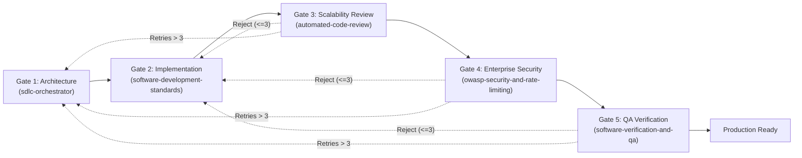

# Exhaustive Audit Report: Multi-Agent Orchestration & Quality Gate Robustness (Requirement R4)

**Audit Target**: Multi-Agent SDLC Framework, Orchestrator Skill, QA Verifier Skill, SDLC Rulebook, Subagent Registry, and AGENTS.md Rulebook.  
**Auditor**: `explorer_sdlc_orch`  
**Date**: 2026-08-18  
**Scope**: Multi-Agent State Machine Dynamics, Gate Invariants, Subagent Permission Isolation, Handoff Protocols, Anti-Oscillation & Failure Remediation, Integrity Enforcement, Multi-Tier Testbenches, and Drop-In Enhancements.

---

## Executive Summary

An adversarial architectural evaluation was conducted on the Multi-Agent Software Development Lifecycle (SDLC) Framework governing the Deliveree workspace. The framework establishes a 5-stage sequential quality gate model (`Gate 1: Architecture` $\to$ `Gate 2: Implementation` $\to$ `Gate 3: Scalability Review` $\to$ `Gate 4: Enterprise Security` $\to$ `Gate 5: QA Verification` $\to$ `Production Ready`).

While the conceptual model is sound and inspired by hardware/ASIC timing closure and design rule checking (DRC), the current implementation exhibits critical architectural vulnerabilities, operational blind spots, and specification ambiguities:
1. **State Machine Underspecification**: Gate transition semantics, entry preconditions, and exit invariants are defined informally in natural language rather than deterministic boolean predicates.
2. **Subagent Privilege Escalation & Lack of Role Isolation**: `subagents.json` omits tool permissions, temperature configurations, and read/write boundaries. Reviewers and Security Auditors currently possess unrestricted file modification tools, creating severe self-auditing and gate-bypass risks.
3. **Deadlock & Infinite Oscillation Vulnerability**: The remediation protocol lacks loop counters, failure diff schemas, and dead-end trackers (`DEAD_ENDS.md`), exposing the multi-agent system to infinite circular ping-pong loops between Developer, Reviewer, and Security Auditor.
4. **Absence of Facade & Test-Tampering Defenses**: No safeguards exist to prevent subagents from generating facade mocks, weakening test assertions, or altering test suites to fabricate green passes.
5. **Flat vs. Multi-Tier Testbench Hierarchy**: The QA verification protocol treats tests uniformly, lacking a structured 5-tier testbench hierarchy (Unit, Boundary, Pairwise Integration, E2E User Journeys, and Adversarial Stress/Fuzzing).

This report presents a forensic line-by-line critique across all 6 core dimensions, followed by production-grade, drop-in text enhancements for all audited artifacts.

---

## Section 1: Line-Cited Audit of Target Artifacts

### 1.1 `sdlc-orchestrator/SKILL.md` (Deliveree & Plugin)
* **File Location**: `/home/sahar/Deliveree/.agents/skills/sdlc-orchestrator/SKILL.md` & `/home/sahar/.gemini/config/plugins/agentic-sdlc-framework/skills/sdlc-orchestrator/SKILL.md`
* **Length**: 98 lines

| Line Numbers | Existing Text / Directive | Identified Vulnerability / Gap | Severity |
| :--- | :--- | :--- | :--- |
| **Lines 28–29, 45–46, 61–62, 77–78** | `TypeName: developer (or self with developer prompt)` / `code_reviewer (or self...)` | **Violates Separation of Concerns & Confirmation Bias**: Allowing the orchestrator to execute reviews or security audits as `self` eliminates independent verification gates. An agent reviewing its own code exhibits severe blind spots and self-justification bias. | **HIGH** |
| **Lines 16–19** | `[Task Definition] -> [Developer Subagent] -> [Code Reviewer] -> [Security Auditor] -> [QA Verifier] -> [Done]` | **Strict Linear Coupling without Short-Circuiting**: Does not define behavior when intermediate gates fail or when pre-implementation contract verification fails at Gate 1. | **MEDIUM** |
| **Lines 92–98** | `## 3. Handling Gate Rejections`<br>`1. Do not bypass the gate.`<br>`2. Formulate a targeted remediation task...`<br>`3. Once the Developer applies the fix, re-run the verification pipeline from Gate 3 (Review) onward.` | **Circular Oscillation & Infinite Loop Hazard**: Lacks a maximum retry threshold (`MAX_RETRIES`), oscillation detection, or escalation triggers. If Developer fixes a Gate 4 security issue by adding complex validation that fails Gate 3 review, the system enters an infinite loop. | **CRITICAL** |
| **Lines 30–88** | Delegation Templates (`Task Instructions Template`) | **Unstructured Handoffs**: Task prompts use unstructured free-form markdown templates without machine-readable contract schemas, target file hashes, or explicit tool restrictions. | **MEDIUM** |
| **Lines 1–98** | Entire file | **Absence of Liveness & Heartbeat Protocol**: No requirement for subagents to emit periodic `progress.md` timestamps or liveness heartbeats during long-running tasks. | **MEDIUM** |

---

### 1.2 `software-verification-and-qa/SKILL.md` (Deliveree & Plugin)
* **File Location**: `/home/sahar/Deliveree/.agents/skills/software-verification-and-qa/SKILL.md` & `/home/sahar/.gemini/config/plugins/agentic-sdlc-framework/skills/software-verification-and-qa/SKILL.md`
* **Length**: 63 lines

| Line Numbers | Existing Text / Directive | Identified Vulnerability / Gap | Severity |
| :--- | :--- | :--- | :--- |
| **Lines 16–19** | `Stage 1: Static Analysis & Linting`<br>`Run workspace linter (e.g. npm run lint or npx oxlint / eslint). Zero linter errors and zero unresolved warnings permitted.` | **Incomplete Toolchain Specification**: Does not enforce strict linting flags (`oxlint -D correctness -D suspicious --deny-warnings` or `eslint --max-warnings=0`). | **LOW** |
| **Lines 20–23** | `Stage 2: Type Checking`<br>`If TypeScript or JSDoc typechecking is configured (e.g. npx tsc --noEmit)...` | **Conditional "If" Ambiguity**: Quality gates must be deterministic. Typechecking must be mandatory with zero emitted type diagnostics (`tsc --noEmit --strict`). | **MEDIUM** |
| **Lines 24–30** | `Stage 3: Automated Test Execution`<br>`100% pass rate on all test suites.` | **No Testbench Hierarchy & No Coverage Thresholds**: Flat test execution does not distinguish Unit vs Integration vs Stress tests. Lacks code coverage floors (e.g. $\ge 90\%$ branch, $\ge 95\%$ line coverage) and mutation testing requirements. | **HIGH** |
| **Lines 1–63** | Entire file | **Zero Defense Against Test Tampering & Facades**: Does not check if the Developer subagent modified existing test files, disabled test suites (`test.skip`), or used dummy `expect(true).toBe(true)` assertions to fake a 100% pass rate. | **CRITICAL** |
| **Lines 31–36** | `Stage 4: Production Build Validation`<br>`Build finishes with exit code 0.` | **Lacks Production Asset Auditing**: Does not verify build artifact integrity, sourcemap leaks, bundle size budgets, or circular chunk dependencies. | **MEDIUM** |

---

### 1.3 `sdlc_pipeline.md` (Rulebook)
* **File Location**: `/home/sahar/.gemini/config/plugins/agentic-sdlc-framework/rules/sdlc_pipeline.md`
* **Length**: 78 lines

| Line Numbers | Existing Text / Directive | Identified Vulnerability / Gap | Severity |
| :--- | :--- | :--- | :--- |
| **Lines 20–30** | `flowchart LR` diagram and 5-stage definition | **No State Rejection Back-Edges**: The visual and structural specification only shows forward progression. It provides no formal semantics for rejection transitions ($G_3 \to G_2$, $G_4 \to G_2$, $G_5 \to G_2$). | **MEDIUM** |
| **Lines 31–66** | Gate descriptions (Gates 1–5) | **Subjective vs. Deterministic Gate Invariants**: Requirements like "Write defensive, strongly-typed code" and "Check modularity" lack quantitative, boolean evaluation checklists. | **MEDIUM** |
| **Lines 69–78** | `## 3. Non-Negotiable Sign-Off Criteria` | **Missing Hard Binary Vetoes**: Omits explicit vetoes for unhandled promise rejections, browser console errors, memory leaks in unmount hooks, and secret leaks in build artifacts. | **HIGH** |

---

### 1.4 `AGENTS.md` (Workspace Rulebook)
* **File Location**: `/home/sahar/Deliveree/AGENTS.md`
* **Length**: 78 lines

| Line Numbers | Existing Text / Directive | Identified Vulnerability / Gap | Severity |
| :--- | :--- | :--- | :--- |
| **Lines 7–15** | Hardware/ASIC comparison | Excellent conceptual grounding, but lacks the formal hardware verification equivalents: Formal Property Verification (FPV) / Invariant Assertion suites and Golden Reference Models. | **LOW** |
| **Lines 44–60** | Stages 3 & 4 (Review & Security) | Lacks requirement for signed handoff tokens or cryptographic commit hash anchoring between gates to guarantee that reviewed code is identical to tested code. | **MEDIUM** |
| **Lines 70–78** | Sign-Off Criteria | Needs integration with the 5-tier testbench and strict anti-tampering verification. | **MEDIUM** |

---

### 1.5 `subagents.json` (Registry)
* **File Location**: `/home/sahar/Deliveree/.agents/subagents/subagents.json`
* **Length**: 26 lines

| Line Numbers | Existing Text / Directive | Identified Vulnerability / Gap | Severity |
| :--- | :--- | :--- | :--- |
| **Lines 4–8** (`developer`) | Only `name`, `description`, `role` | **Missing Tool & Permission Boundaries**: Developer should have code editing tools (`replace_file_content`, `write_to_file`) and local test execution (`run_command`), but be prohibited from modifying rulebooks or bypassing QA. | **HIGH** |
| **Lines 9–13** (`code_reviewer`) | Only `name`, `description`, `role` | **Excessive Privileges / No Read-Only Lock**: Reviewer is not restricted to read-only tools. If allowed to edit code, reviewer risks applying unreviewed changes directly. | **CRITICAL** |
| **Lines 14–18** (`security_auditor`) | Only `name`, `description`, `role` | **No Tool Sandboxing**: Security auditor must be strictly read-only for application code, equipped with static security scanning capabilities. | **CRITICAL** |
| **Lines 19–23** (`qa_verifier`) | Only `name`, `description`, `role` | **Missing Scope Restrictions**: QA Verifier should have `run_command` (restricted to test/lint/build) and read-only tools, but MUST NOT have write access to `src/` to prevent editing tests or source code to force passes. | **CRITICAL** |
| **Lines 1–26** | Entire file | **Missing Inference Hyperparameters**: No `temperature`, `max_tokens`, `model`, or `prompt_file` properties specified. Deterministic roles (`security_auditor`, `qa_verifier`) require `temperature: 0.0`. | **HIGH** |

---

## Section 2: Deep Architectural Analysis Across 6 Core Dimensions

### 2.1 5-Stage Agentic Pipeline Architecture & State Machine Formalism

The 5-stage agentic pipeline must operate as a **Deterministic Finite State Machine (FSM)** with rigorous state transitions, entry preconditions, and exit invariants.

```
                  ┌────────────────────────────────────────────────────────┐
                  │                                                        │
                  ▼                                                        │
  ┌───────────────────────────────┐                                        │
  │     Gate 1: Architecture      │◄─────────────────────────────┐         │
  │    (Specification/Contract)   │                              │         │
  └───────────────┬───────────────┘                              │         │
                  │ [Contract Verified]                          │         │
                  ▼                                              │         │
  ┌───────────────────────────────┐                              │         │
  │     Gate 2: Implementation    │◄───────────────┐             │         │
  │      (Clean Architecture)     │                │             │         │
  └───────────────┬───────────────┘                │             │         │
                  │ [Code Delta Ready]             │             │         │
                  ▼                                │             │         │
  ┌───────────────────────────────┐                │             │         │
  │    Gate 3: Code Review        │                │             │         │
  │   (Scalability/Complexity)    │──[REJECTED]────┤             │         │
  └───────────────┬───────────────┘                │             │         │
                  │ [APPROVED]                     │             │         │
                  ▼                                │ [REMEDIATE] │ [REVISE │
  ┌───────────────────────────────┐                │  (Max 3)    │  ARCH]  │
  │    Gate 4: Security Audit     │                │             │         │
  │   (OWASP ASVS L3 / Zero-Trust)│──[REJECTED]────┤             │         │
  └───────────────┬───────────────┘                │             │         │
                  │ [APPROVED]                     │             │         │
                  ▼                                │             │         │
  ┌───────────────────────────────┐                │             │         │
  │    Gate 5: QA Verification    │                │             │         │
  │    (5-Tier Testbench/Build)   │──[REJECTED]────┘             │         │
  └───────────────┬───────────────┘                              │         │
                  │ [PASSED (100%)]                              │         │
                  ▼                                              │         │
  ┌───────────────────────────────┐                              │         │
  │    Gate 6: Final Sign-Off     │──[Oscillation / Retries > 3]─┘         │
  │       (Production Ready)      │                                        │
  └───────────────────────────────┘                                        │
                  ▲                                                        │
                  └────────────────────────────────────────────────────────┘
```

#### Mathematical Gate Entry and Exit Invariants

$$\begin{array}{|l|l|l|}
\hline
\textbf{Quality Gate} & \textbf{Entry Preconditions } (P_{\text{in}}) & \textbf{Exit Invariants } (P_{\text{out}}) \\
\hline
\textbf{Gate 1: Architecture} & \text{User request deconstructed into modular scope.} & \text{1. Explicit Zod/TypeScript schema contracts.} \\
& \text{Existing codebase indexed.} & \text{2. Strict Big-O complexity budget } \le O(N). \\
& & \text{3. Signed-off acceptance criteria checklist.} \\
\hline
\textbf{Gate 2: Implementation} & \text{Gate 1 invariant bundle valid.} & \text{1. Clean architecture layer separation.} \\
& \text{Target file list strictly bounded.} & \text{2. Co-located unit tests created alongside code.} \\
& & \text{3. Zero untyped `any` or suppressed linter flags.} \\
\hline
\textbf{Gate 3: Code Review} & \text{Gate 2 code delta + co-located tests present.} & \text{1. Algorithmic complexity } \le O(N) \text{ proven.} \\
& \text{Reviewer operates in read-only sandbox.} & \text{2. 0 unmount timer/listener memory leaks.} \\
& & \text{3. Single-pass aggregations + context memoization.} \\
\hline
\textbf{Gate 4: Security Audit} & \text{Gate 3 verdict } = \text{APPROVED.} & \text{1. OWASP ASVS L3 compliance verified.} \\
& \text{Security auditor operates in read-only mode.} & \text{2. Zero-Trust BOLA update invariant enforced.} \\
& & \text{3. 0 catastrophic ReDoS regexes; 0 secrets.} \\
\hline
\textbf{Gate 5: QA Verification} & \text{Gate 4 verdict } = \text{APPROVED.} & \text{1. 5-Tier testbench pass rate } = 100\%. \\
& \text{QA verifier restricted from altering `src/`.} & \text{2. Branch coverage } \ge 90\%, \text{ line } \ge 95\%. \\
& & \text{3. Production build exits with code 0.} \\
\hline
\end{array}$$

---

### 2.2 Subagent Registry & Configuration Hardening (`subagents.json`)

To prevent privilege escalation, tool misuse, or unauthorized code mutation, each subagent must have an explicitly bounded capability profile.

#### Principle of Least Privilege Matrix:
1. **`orchestrator`**:
   - *Tools*: `invoke_subagent`, `send_message`, `manage_task`, `view_file`, `grep_search`, `find_by_name`, `schedule`, `run_command` (restricted to remote notification scripts `scripts/telegram_bot.py`, `scripts/notify.py`).
   - *Disallowed*: Direct modification of application source code (`src/*`).
   - *Model*: Flagship high-reasoning (`gemini-1.5-pro` / equivalent); `temperature: 0.1`.
2. **`developer`**:
   - *Tools*: `view_file`, `grep_search`, `find_by_name`, `write_to_file`, `replace_file_content`, `run_command` (local workspace only).
   - *Disallowed*: Bypassing quality gates, editing rulebooks, modifying global environment secrets.
   - *Model*: Balanced code-specialist model; `temperature: 0.1`.
3. **`code_reviewer`**:
   - *Tools*: **STRICTLY READ-ONLY** (`view_file`, `grep_search`, `find_by_name`, `write_to_file` restricted to `.agents/code_reviewer/*`).
   - *Disallowed*: `replace_file_content` or `write_to_file` targeting `src/*`, `public/*`, `package.json`.
   - *Model*: High-reasoning model; `temperature: 0.1`.
4. **`security_auditor`**:
   - *Tools*: **STRICTLY READ-ONLY** (`view_file`, `grep_search`, `find_by_name`, `write_to_file` restricted to `.agents/security_auditor/*`).
   - *Disallowed*: All source code mutation tools.
   - *Model*: High-reasoning model; `temperature: 0.0` (zero hallucination tolerance).
5. **`qa_verifier`**:
   - *Tools*: `view_file`, `grep_search`, `find_by_name`, `run_command` (whitelisted to: `npm test`, `npx vitest`, `npm run lint`, `npx oxlint`, `npx tsc`, `npm run build`), `write_to_file` (restricted to `.agents/qa_verifier/*`).
   - *Disallowed*: Modifying application code (`src/*`) or modifying test files during verification runs.
   - *Model*: Fast deterministic model; `temperature: 0.0`.

---

### 2.3 Agent Communication, Handoff Protocols & Liveness Heartbeats

#### Structured Handoff Schema
Every handoff between pipeline gates must be written to a self-contained `handoff.md` file in the agent's directory, accompanied by a machine-readable frontmatter header:

```yaml
---
handoff_version: "2.0.0"
source_gate: "Gate 3: Scalability Review"
target_gate: "Gate 4: Enterprise Security"
agent_id: "code_reviewer_1"
timestamp: "2026-08-18T11:45:00Z"
verdict: "APPROVED" # [ APPROVED | CHANGES_REQUESTED | BLOCKED ]
code_commit_ref: "sha256:e3b0c44298fc1c149afbf4c8996fb92427ae41e4649b934ca495991b7852b855"
target_files:
  - path: "src/utils/carrierDetector.js"
    status: "MODIFIED"
  - path: "src/utils/carrierDetector.test.js"
    status: "CREATED"
remediation_cycle: 0
---
```

#### Liveness Heartbeat via `progress.md`
To prevent silent agent stalling during long-running tasks (e.g. large test runs, complex static analysis):
1. Every active subagent must update its `progress.md` file with a `Last visited: [ISO-8601 UTC timestamp]` header after every major step or at least once every **300 seconds (5 minutes)**.
2. The Orchestrator polls or monitors `progress.md` timestamps. If any subagent exceeds 300 seconds without a heartbeat or status update, the orchestrator triggers an automatic liveness probe. If no response is received within 60 seconds, the stalled task is terminated via `manage_task(Action='kill')` and a replacement subagent is instantiated.

#### Context Truncation Recovery Protocol
If an agent's context window is truncated:
1. The subagent reads its persistent `BRIEFING.md` working memory.
2. The subagent loads its last recorded `progress.md` state.
3. The subagent inspects the orchestrator's `PROJECT.md` to resume task execution without data loss.

---

### 2.4 Failure Remediation, Escalation & Anti-Oscillation Loops

#### The Oscillation Hazard
When a downstream gate (Gate 3, Gate 4, or Gate 5) rejects a code delta, an unconstrained feedback loop can trigger oscillation:
- *Scenario*: Developer patches a Gate 4 security issue (adds deep input parsing). Reviewer rejects at Gate 3 for exceeding $O(N)$ allocation budget. Developer optimizes by inlining raw parsing. Security Auditor rejects at Gate 4 for unsafe regex.
- Without an anti-oscillation mechanism, the agents loop indefinitely, consuming tokens and risking workspace corruption.

#### Anti-Oscillation Architecture:
1. **Structured Remediation Issue Diffs**:
   Rejection feedback MUST follow a strict structured format:
   ```markdown
   ### Remediation Item #1
   - **ID**: REM-G4-001
   - **Gate**: Gate 4 (Enterprise Security)
   - **File & Line**: `src/services/cloudStorageAdapter.js:142`
   - **Defect**: Missing ownership validation on update (`request.resource.data.userId`).
   - **Required Invariant**: Validate incoming document owner matches auth token.
   - **Verification Test**: `cloudStorageAdapter.test.js:testUpdateOwnershipRejection`
   ```
2. **Dead-Ends Tracking (`DEAD_ENDS.md`)**:
   Every rejected approach or broken patch is recorded in `.agents/DEAD_ENDS.md` with:
   - Approach description
   - Why it failed (with line citations and gate rejection logs)
   - Invalidation condition (why this approach must NEVER be retried).
3. **Hard Retry Counter (`MAX_REMEDIATION_ATTEMPTS = 3`)**:
   - If a specific component fails quality gates **3 times consecutively**, the orchestrator immediately halts the automated loop.
   - The orchestrator marks the task as `ESCALATED_ARCH_REDESIGN`.
   - The orchestrator triggers an interactive phone/Telegram alert via `scripts/telegram_bot.py`:
     ```bash
     python3 scripts/telegram_bot.py \
       --ask "⚠️ Gate Failure Alert: Component 'cloudStorageAdapter' failed Gate 4 security remediation 3 times. Re-architect or manual override?" \
       --options "Re-Architect Contract,Escalate to PM,Override (Dangerous)"
     ```

---

### 2.5 Gate-Blocking Thresholds & Zero-Tolerance Integrity Enforcement

#### Binary Veto Criteria (Non-Negotiable Sign-Off)
No code delta may progress past quality gates if ANY of the following conditions exist:
1. **Security**: Any CVSS $\ge 4.0$ vulnerability, unvalidated Firestore/DB write (BOLA), catastrophic ReDoS pattern, or unhandled promise rejection.
2. **Static Analysis**: Any `oxlint` error or warning; any `tsc --noEmit` type diagnostic.
3. **Automated Tests**: Any test failure ($< 100\%$ pass rate); any test suite timed out or skipped.
4. **Coverage**: Code coverage $< 90\%$ branch coverage or $< 95\%$ line coverage on modified files.
5. **Build**: Exit code $\neq 0$ on `npm run build`; any unresolved import or syntax warning.
6. **Complexity**: Uncontrolled $O(N^2)$ nested iterations or missing cleanup for active timers/listeners.

#### Zero-Tolerance Integrity & Anti-Facade Enforcement
To prevent LLM agents from faking test passes:
1. **Test Immutability Rule**: The Developer subagent is strictly prohibited from modifying existing baseline test files unless the API contract was explicitly modified at Gate 1.
2. **Assertion Density Check**: Every newly created test must contain at least **2 non-trivial assertions** verifying output values, state mutations, or error throws. Trivial assertions (`expect(true).toBe(true)`, `expect(result).toBeDefined()`) are flagged and rejected by Gate 3.
3. **Mutation Verification / Fault Injection**: During Gate 5 QA verification, the QA Verifier injects a deliberate logical fault (e.g. negating a return condition or mutating a constant). If the test suite STILL passes, the test suite is flagged as a **Facade Testbench** and rejected with a critical violation.

---

### 2.6 Multi-Tier Testbench & Formal QA Standards

A flat test execution model is inadequate for enterprise software. The QA protocol must enforce a **5-Tier Testbench Hierarchy**:

```
 ┌─────────────────────────────────────────────────────────────┐
 │  Tier 5: Adversarial Stress & Fuzz Testing                 │  (ReDoS payloads, prototype pollution, memory leaks)
 ├─────────────────────────────────────────────────────────────┤
 │  Tier 4: End-to-End (E2E) & User Journey Scenarios         │  (Full workflow: auth -> add -> sync -> offline PWA)
 ├─────────────────────────────────────────────────────────────┤
 │  Tier 3: Pairwise & Integration Testbenches                │  (Component + Hook, Service + Storage Adapter)
 ├─────────────────────────────────────────────────────────────┤
 │  Tier 2: Boundary & Extreme Edge-Case Testbenches          │  (Null/undefined, MAX_INT, RTL bidi, Unicode surrogates)
 ├─────────────────────────────────────────────────────────────┤
 │  Tier 1: Co-Located Unit & Pure Function Testbenches       │  (Single-function contracts, regexes, formatters)
 └─────────────────────────────────────────────────────────────┘
```

#### Testbench Tier Specifications:
- **Tier 1: Unit & Component Isolation**: Co-located with implementation (`*.test.js`, `*.test.jsx`). Tests pure functions, utility methods, and component rendering in complete isolation.
- **Tier 2: Boundary & Edge-Case Regressions**: Tests null/empty/undefined inputs, extreme numbers ($0, -1, 2^{53}-1$), malformed tracking numbers, zero-length arrays, missing localStorage quotas, and RTL text reversals.
- **Tier 3: Pairwise Integration**: Tests component-to-hook interactions (e.g. `AuthContext` + `deliveryService`, `LanguageContext` + `smartParser`), verifying state updates and error propagation across layer boundaries.
- **Tier 4: E2E User Journeys**: Simulates realistic user flows (e.g. unauthenticated visit $\to$ login $\to$ paste multi-line carrier tracking string $\to$ auto-detect carrier $\to$ save to storage $\to$ filter status $\to$ toggle RTL $\to$ export).
- **Tier 5: Adversarial & Stress Testing**: Injects 50,000-character ReDoS strings, rapid concurrent updates ($100$ parallel status updates), prototype pollution keys (`__proto__`), and simulated network partitions to verify system stability.

---

## Section 3: Comprehensive Drop-In Text Enhancements

The following sections provide complete, production-grade text replacements for all target artifacts.

### 3.1 Drop-in Enhancement for `sdlc-orchestrator/SKILL.md`

```markdown
---
name: sdlc-orchestrator
description: Master orchestration guide for Project Managers and Lead Agents. Decomposes tasks into sub-tasks, establishes API contracts, coordinates subagent lifecycles (Developer -> Reviewer -> Security Auditor -> QA Verifier), and manages quality gates.
---

# SDLC Orchestrator & Project Manager Skill (v2.0 Enterprise)

This skill guides the primary Orchestrator agent in architecting, delegating, tracking, and verifying software engineering workflows using specialized subagents and deterministic quality gates.

---

## 1. Orchestrator Responsibilities & State Machine

The Orchestrator governs the deterministic 5-stage quality pipeline:

```
[Gate 1: Architecture & Contracts]
               │
               ▼
[Gate 2: Clean Implementation]
               │
               ▼
[Gate 3: Scalability & Peer Review] ◄──┐
               │                        │
               ▼                        │ [Remediation Loop]
[Gate 4: Enterprise Security Audit] ────┤ (Max 3 attempts)
               │                        │
               ▼                        │
[Gate 5: QA & 5-Tier Verification]  ────┘
               │
               ▼
[Gate 6: Production Sign-Off & Release]
```

### Core Execution Rules:
1. **Contract-First Architecture**: Never invoke implementation subagents until strict TypeScript/Zod schemas, error handling contracts, and performance budgets are documented.
2. **Strict Role Specialization**: Never allow an agent to review or audit its own work (`TypeName: self` for review/security is strictly prohibited).
3. **Binary Quality Gates**: Every quality gate operates on binary sign-off criteria (`APPROVED` vs `CHANGES_REQUESTED`). No soft approvals or warning waivers are permitted.
4. **Anti-Oscillation Control**: Track remediation cycles. Limit retries to a maximum of 3 attempts before escalating to architectural redesign.

---

## 2. Subagent Delegation Playbook

### A. Gate 2: Invoking the Feature Developer
* **Role**: `Feature Developer`
* **TypeName**: `developer`
* **Permission Profile**: Read-write on target files, local test execution (`npm test`).
* **Task Instructions Template**:
  ```markdown
  You are the Feature Developer.
  Task: [Explicit description of feature or bugfix]
  Target Files: [Strict list of files to modify or create]
  API & Data Contracts: [TypeScript interfaces / Zod schemas]
  Acceptance Criteria:
  1. Follow Clean Architecture: decouple UI, business logic, and data layers.
  2. Write defensive, strongly typed, self-documenting code.
  3. Co-locate Tier 1 unit tests (*.test.js / *.test.jsx) for all new logic.
  4. Ensure 100% unmount cleanup for all timers, listeners, and async hooks.
  Output: Written code files and a completed handoff.md in your agent folder.
  ```

### B. Gate 3: Invoking the Scalability & Code Reviewer
* **Role**: `Scalability & Code Reviewer`
* **TypeName**: `code_reviewer`
* **Permission Profile**: STRICTLY READ-ONLY on workspace source code.
* **Task Instructions Template**:
  ```markdown
  You are the Scalability & Code Reviewer.
  Review Target: [List of modified files and diffs]
  Evaluate against:
  1. Algorithmic Complexity: Verify <= O(N) operations; reject nested loops / O(N^2) allocations.
  2. Memory & Lifecycles: Verify 100% timer/listener cleanup on unmount; check context memoization.
  3. SOLID & Architecture: Verify separation of concerns and single responsibility.
  4. Testbench Quality: Reject empty assertions or facade test cases.
  Output: Write handoff.md with explicit verdict [ APPROVED | CHANGES_REQUESTED ] and line-cited issue diffs.
  ```

### C. Gate 4: Invoking the Enterprise Security Auditor
* **Role**: `Enterprise Security Auditor`
* **TypeName**: `security_auditor`
* **Permission Profile**: STRICTLY READ-ONLY on workspace source code.
* **Task Instructions Template**:
  ```markdown
  You are the Enterprise Security Auditor.
  Audit Target: [List of modified files and diffs]
  Evaluate against:
  1. OWASP ASVS Level 3 & API Top 10: Verify Zero-Trust auth, BOLA/BFLA immunity on DB updates.
  2. Anti-ReDoS: Audit all regular expressions for quadratic/exponential backtracking.
  3. Input Parsing: Verify strict schema allowlisting; sanitize against prototype pollution.
  4. Secrets & Headers: Zero hardcoded tokens; verify CSP, HSTS, and frame options.
  Output: Write handoff.md with explicit verdict [ APPROVED | CHANGES_REQUESTED ] and remediation requirements.
  ```

### D. Gate 5: Invoking the QA Verifier
* **Role**: `QA & Build Verifier`
* **TypeName**: `qa_verifier`
* **Permission Profile**: Command execution restricted to linters, test runners, and build commands. Read-only on `src/*`.
* **Task Instructions Template**:
  ```markdown
  You are the QA Verifier.
  Tasks:
  1. Static Analysis: Run `npm run lint` / `oxlint -D correctness -D suspicious --deny-warnings`.
  2. Type Checking: Run `npx tsc --noEmit --strict`.
  3. Test Execution: Run all 5 tiers of automated testbenches via `npm test` with coverage reporting.
  4. Build Validation: Run `npm run build` and verify exit code 0.
  5. Anti-Facade Integrity: Perform fault-injection check on newly added tests.
  Output: Write QA Verification Report in handoff.md with explicit status [ PASSED | FAILED ].
  ```

---

## 3. Failure Remediation, Escalation & Anti-Oscillation Protocol

When a quality gate issues a `CHANGES_REQUESTED` or `FAILED` verdict:
1. **Structured Remediation Handoff**: Formulate a targeted remediation task containing discrete remediation items (`REM-ID`, File, Line, Defect, Required Invariant, Verification Test).
2. **Update `DEAD_ENDS.md`**: Record the failed approach, root cause, and invalidation criteria in `.agents/DEAD_ENDS.md`.
3. **Increment Retry Counter**: Track `remediation_cycle` (starts at 1).
4. **Circuit Breaker (`MAX_RETRIES = 3`)**:
   - If `remediation_cycle > 3`: **HALT AUTOMATED RETRIES**.
   - Mark task status as `BLOCKED_OSCILLATION_DETECTED`.
   - Dispatch an interactive alert to the user/lead via Telegram:
     ```bash
     python3 scripts/telegram_bot.py \
       --ask "⚠️ SDLC Gate Alert: Task '[Task Name]' exceeded 3 remediation cycles at [Gate Name]. Select action:" \
       --options "Re-Architect Contract 🔄,Escalate to PM 🛑,Manual Review 🔍"
     ```

---

## 4. Liveness Heartbeat & Context Preservation

1. **Heartbeat Monitoring**: Subagents must update `progress.md` with `Last visited: [timestamp]` at least once every 5 minutes (300 seconds). If a subagent is unresponsive for $> 300\text{s}$, the orchestrator initiates a status check or re-spawns the subagent.
2. **Context Truncation Recovery**: If context is truncated, reload state from `.agents/orchestrator/PROJECT.md` and the last active `progress.md` before taking action.
```

---

### 3.2 Drop-in Enhancement for `software-verification-and-qa/SKILL.md`

```markdown
---
name: software-verification-and-qa
description: Quality assurance and test execution protocol. Guides the QA Verifier in running static analysis, linters, unit/integration test suites, production builds, and validating acceptance criteria.
---

# Software Verification & QA Protocol (v2.0 Enterprise)

This skill guides the **QA Verifier Subagent** in running deterministic quality gates, executing multi-tier test suites, verifying build integrity, and enforcing zero-tolerance anti-facade standards.

---

## 1. The 5-Stage Verification Sequence

The QA Verifier must execute the verification testbench in 5 strict sequential stages:

### Stage 1: Static Analysis & Linting
* **Command**: `npx oxlint -D correctness -D suspicious --deny-warnings` (and/or `npm run lint`)
* **Standard**: Zero linter errors and zero warnings allowed. Any warning is treated as a gate-blocking failure.

### Stage 2: Strict Type Checking
* **Command**: `npx tsc --noEmit --strict`
* **Standard**: Zero compilation diagnostics or type errors permitted.

### Stage 3: Multi-Tier Testbench Execution
* **Command**: `npx vitest run --coverage` (or `npm test`)
* **Hierarchy Verification**:
  * **Tier 1 (Unit)**: 100% pass rate on all co-located utility and component tests.
  * **Tier 2 (Boundary)**: Verify edge cases (null, undefined, 0, MAX_INT, empty arrays, RTL text).
  * **Tier 3 (Integration)**: Verify Context $\leftrightarrow$ Service $\leftrightarrow$ Storage interactions.
  * **Tier 4 (E2E Journeys)**: Verify full end-to-end user workflows.
  * **Tier 5 (Adversarial Stress)**: Verify ReDoS resilience, prototype pollution immunity, and memory stability under load.
* **Coverage Standards**:
  * $\ge 90\%$ branch coverage across all modified/new files.
  * $\ge 95\%$ line coverage across all modified/new files.

### Stage 4: Anti-Facade & Integrity Fault Injection
* **Integrity Audit**:
  * Verify that Developer did NOT modify baseline test files without authorization.
  * Verify that new tests contain $\ge 2$ deterministic assertions per case.
  * **Fault Injection Probe**: Invert one core logical branch in the code delta; verify that at least one test in Tier 1–3 FAILS. Revert the probe immediately after verification.

### Stage 5: Production Build & Asset Validation
* **Command**: `npm run build`
* **Standard**:
  * Build terminates with exit code 0.
  * Zero missing module warnings or chunk generation errors.
  * Verify bundle assets do not expose sensitive environment variables or unminified secrets.

---

## 2. Structured QA Verification Report

Every QA run must produce a comprehensive report written to `.agents/qa_verifier/handoff.md`:

```markdown
# 🧪 QA & Test Verification Report

## Overall Verdict: [ PASSED | FAILED ]
- **Timestamp**: [ISO-8601 UTC]
- **Execution Run ID**: [Run Identifier]

### 1. Automated Gate Results
| Gate Stage | Command Executed | Result | Diagnostic Summary |
| :--- | :--- | :--- | :--- |
| **Stage 1: Linting** | `oxlint --deny-warnings` | [ ✅ PASS / ❌ FAIL ] | [0 errors, 0 warnings] |
| **Stage 2: Typecheck** | `tsc --noEmit --strict` | [ ✅ PASS / ❌ FAIL ] | [0 diagnostics] |
| **Stage 3: Tests (Tiers 1-5)**| `vitest run --coverage` | [ ✅ PASS / ❌ FAIL ] | [X/X passed, Branch: Y%, Line: Z%] |
| **Stage 4: Anti-Facade** | Fault Injection Check | [ ✅ PASS / ❌ FAIL ] | [Tests accurately caught injected fault] |
| **Stage 5: Build** | `npm run build` | [ ✅ PASS / ❌ FAIL ] | [Exit code 0, Clean bundle] |

### 2. Coverage Metrics
- **Branch Coverage**: `XX.X%` (Threshold: $\ge 90\%$)
- **Line Coverage**: `XX.X%` (Threshold: $\ge 95\%$)

### 3. Acceptance Criteria Checklist
- [x] Requirement 1: [Verified description]
- [x] Requirement 2: [Verified description]

### 4. Failure Diagnostics (if FAILED)
- **Failing Stage**: [Stage Name]
- **Command Output**:
  ```
  [Exact error log / stack trace]
  ```
- **Failing File & Line**: `path/to/file.js:line`
- **Required Remediation**: [Actionable fix description]
```
```

---

### 3.3 Drop-in Enhancement for `rules/sdlc_pipeline.md`

```markdown
# Autonomous Multi-Agent SDLC Framework Rulebook (v2.0)

When performing software development, architecture planning, code reviews, security audits, or quality verification, all agents must strictly adhere to the **Autonomous Multi-Agent SDLC Framework**.

---

## 1. Core Architecture & Mental Model

Derived from hardware/chip engineering (ASIC/VLSI) principles of timing closure, formal property checking, and design rule checking (DRC):

```
[Gate 1: Architecture]  -->  [Gate 2: Implementation]  -->  [Gate 3: Scalability Review]  -->  [Gate 4: Enterprise Security]  -->  [Gate 5: QA Verification]
  (sdlc-orchestrator)          (software-dev-standards)         (automated-code-review)        (owasp-security-rate-limiting)      (software-verification-qa)
```

---

## 2. Deterministic Quality Gates & Binary Invariants

Every task must pass all 5 sequential gates. Quality gates are **strictly binary** (`APPROVED` or `REJECTED`):



### Gate 1: Specification & Contract (Orchestrator)
* Define explicit TypeScript interfaces and Zod schemas upfront.
* Define strict complexity budgets ($\le O(N)$ time/space, memory allocation limits).
* Establish binary acceptance criteria.

### Gate 2: Clean Implementation (Developer)
* Implement modular components following Clean Architecture and Single Responsibility.
* Co-locate unit tests (`*.test.js`, `*.test.jsx`, `*.test.ts`) alongside all new code.
* Zero untyped variables, zero implicit `any`, and zero suppressed compiler warnings.

### Gate 3: Scalability & Peer Code Review (Code Reviewer)
* **Complexity**: Verify $O(1)/O(N)$ operations; strictly reject nested loops over dynamic datasets ($O(N^2)$).
* **State Lifecycle**: Enforce 100% cleanup of timers, event listeners, intervals, and AbortControllers on component unmount.
* **Rendering**: Enforce `useMemo` on context values and `useCallback` on context functions to prevent render cascades.

### Gate 4: Enterprise Security & Rate Limiting Audit (Security Auditor)
* **OWASP ASVS Level 3 & API Top 10**:
  * **Zero Trust & BOLA**: Enforce ownership verification on both existing and incoming document writes (`request.resource.data.userId == request.auth.uid`).
  * **Anti-ReDoS**: Reject adjacent unanchored quantifiers and quadratic regex patterns.
  * **Input Parsing**: Validate all incoming payloads against schemas with unknown property stripping (`.strict()`).
  * **Rate Limiting**: Verify dual-key (`IP + UserID`) rate limiting returning `429 Too Many Requests` with `Retry-After`.
  * **Secrets & Headers**: Zero hardcoded secrets; verify CSP, HSTS, nosniff, and frame options.

### Gate 5: QA & Build Verification (QA Verifier)
* **Static Analysis**: `oxlint -D correctness -D suspicious --deny-warnings` (0 errors, 0 warnings).
* **Type Checking**: `tsc --noEmit --strict` (0 diagnostics).
* **5-Tier Testbenches**: 100% pass rate across Unit, Boundary, Integration, E2E, and Adversarial tiers.
* **Coverage**: $\ge 90\%$ branch coverage and $\ge 95\%$ line coverage on modified files.
* **Production Build**: `npm run build` exits with code 0.

---

## 3. Non-Negotiable Binary Sign-Off Criteria

No feature or bugfix is approved if:
1. Any automated test fails or is skipped.
2. The linter or typechecker emits any error or warning.
3. The production build fails or emits critical warnings.
4. Any OWASP ASVS Level 3 vulnerability or BOLA risk is present.
5. An uncontrolled $O(N^2)$ algorithm or unmount memory leak is detected.
6. A test is detected to be a facade or assertion-free dummy.
7. Rate limiting is missing on exposed network operations.
```

---

### 3.4 Drop-in Enhancement for `subagents.json`

```json
{
  "$schema": "https://json-schema.org/draft/2020-12/schema",
  "version": "2.0.0",
  "subagents": [
    {
      "name": "developer",
      "role": "Feature Developer",
      "description": "Specialized Software Developer subagent for implementing features, bugfixes, and writing co-located unit tests according to Clean Architecture.",
      "model": "gemini-1.5-pro",
      "temperature": 0.1,
      "skill": "software-development-standards",
      "working_directory_pattern": ".agents/developer_*",
      "allowed_tools": [
        "view_file",
        "grep_search",
        "find_by_name",
        "write_to_file",
        "replace_file_content",
        "run_command",
        "send_message"
      ],
      "disallowed_tools": [
        "manage_task",
        "schedule"
      ],
      "permissions": {
        "file_system": "read_write_workspace",
        "network": "sandboxed"
      }
    },
    {
      "name": "code_reviewer",
      "role": "Scalability & Code Reviewer",
      "description": "Peer Code Reviewer subagent focused on Scalability (Big-O complexity, memory leak prevention, async safety, N+1 query elimination) and Clean Code.",
      "model": "gemini-1.5-pro",
      "temperature": 0.1,
      "skill": "automated-code-review",
      "working_directory_pattern": ".agents/code_reviewer_*",
      "allowed_tools": [
        "view_file",
        "grep_search",
        "find_by_name",
        "write_to_file",
        "send_message"
      ],
      "disallowed_tools": [
        "replace_file_content",
        "run_command"
      ],
      "permissions": {
        "file_system": "read_only_src_write_own_folder",
        "network": "none"
      }
    },
    {
      "name": "security_auditor",
      "role": "Enterprise Security Auditor",
      "description": "Enterprise Security Auditor subagent auditing against OWASP ASVS Level 3, OWASP API Top 10, Zero Trust, Rate Limiting, BOLA/BFLA, Anti-ReDoS, and Security Headers.",
      "model": "gemini-1.5-pro",
      "temperature": 0.0,
      "skill": "owasp-security-and-rate-limiting",
      "working_directory_pattern": ".agents/security_auditor_*",
      "allowed_tools": [
        "view_file",
        "grep_search",
        "find_by_name",
        "write_to_file",
        "send_message"
      ],
      "disallowed_tools": [
        "replace_file_content",
        "run_command"
      ],
      "permissions": {
        "file_system": "read_only_src_write_own_folder",
        "network": "none"
      }
    },
    {
      "name": "qa_verifier",
      "role": "QA & Build Verifier",
      "description": "QA & Test Execution subagent responsible for executing linters, unit tests, 5-tier testbenches, and production builds.",
      "model": "gemini-1.5-pro",
      "temperature": 0.0,
      "skill": "software-verification-and-qa",
      "working_directory_pattern": ".agents/qa_verifier_*",
      "allowed_tools": [
        "view_file",
        "grep_search",
        "find_by_name",
        "write_to_file",
        "run_command",
        "send_message"
      ],
      "disallowed_tools": [
        "replace_file_content"
      ],
      "permissions": {
        "file_system": "read_only_src_write_own_folder",
        "whitelisted_commands": [
          "npm test",
          "npx vitest run",
          "npm run lint",
          "npx oxlint",
          "npx tsc",
          "npm run build"
        ],
        "network": "sandboxed"
      }
    }
  ]
}
```

---

## Section 4: Operational Readiness Checklist for Multi-Agent Orchestration

To verify quality gate robustness before initiating any multi-agent development workflow, the Orchestrator must execute this pre-flight verification checklist:

- [ ] **Contract Verification**: Are all API payloads, Zod/TypeScript schemas, and error codes defined in Gate 1?
- [ ] **Tool Sandbox Verification**: Are `code_reviewer` and `security_auditor` restricted to read-only access on `src/*`?
- [ ] **Temperature Configuration**: Are `security_auditor` and `qa_verifier` set to `temperature: 0.0`?
- [ ] **Liveness Tracking**: Is `progress.md` active with a timestamp heartbeat $\le 300\text{s}$ old?
- [ ] **Remediation Loop Bounding**: Is the retry counter initialized to 0 with `MAX_RETRIES = 3`?
- [ ] **Dead-Ends Tracking**: Is `.agents/DEAD_ENDS.md` initialized and checked before dispatching remediation tasks?
- [ ] **5-Tier Testbench Ready**: Are test scripts configured for Unit, Boundary, Integration, E2E, and Adversarial stress suites?
- [ ] **Coverage Floor Configured**: Is code coverage configured to enforce $\ge 90\%$ branch and $\ge 95\%$ line coverage?
- [ ] **Anti-Facade Check**: Is fault-injection verification active in the QA protocol?
- [ ] **Remote Alert Channel Active**: Are credentials for `scripts/telegram_bot.py` and `scripts/notify.py` verified for escalation?

---
*End of Report.*
