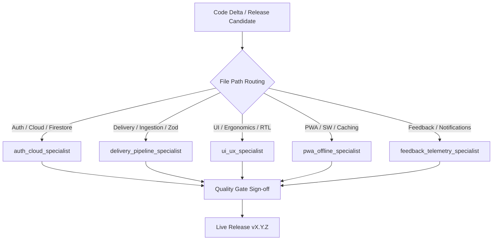

# Project Release Tracking & Version Governance Protocol

This skill standardizes release management, versioning invariants, cache invalidation, and component specialist orchestration across the Deliveree lifecycle.

---

## 1. Semantic Versioning Specification (SemVer 2.0.0)

Every release adheres to `vMAJOR.MINOR.PATCH[-PRERELEASE]`:

* **MAJOR (X.0.0)**: Breaking architectural changes, incompatible database schema migrations, or fundamental paradigm shifts.
* **MINOR (0.X.0)**: New user-facing epics or subsystem capabilities (e.g. OCR ingestion, live carrier webhooks, PWA auto-update).
* **PATCH (0.0.X)**: Bug fixes, defensive hardening, accessibility tweaks, and minor dependency upgrades.
* **PRERELEASE Channels**:
  - `alpha`: Active development and early feature verification.
  - `beta`: Feature-complete candidate under chaos and penetration testing.
  - `rc`: Release candidate ready for production deployment.
  - `release`: Stable public production build.

---

## 2. Release Synchronization Protocol

When a version bump occurs, the following files **MUST** be updated atomically:

1. **[`package.json`](file:///home/sahar/Deliveree/package.json)**: Update `"version": "X.Y.Z-channel"`.
2. **[`src/constants/version.js`](file:///home/sahar/Deliveree/src/constants/version.js)**:
   ```javascript
   export const APP_VERSION = 'X.Y.Z-channel';
   export const RELEASE_DATE = 'YYYY-MM-DD';
   export const BUILD_CHANNEL = 'alpha'; // alpha | beta | rc | production
   export const FIREBASE_SCHEMA_VERSION = '1.0.0';
   ```
3. **[`public/sw.js`](file:///home/sahar/Deliveree/public/sw.js)**:
   Increment cache name to force immediate client-side cache busting:
   ```javascript
   const CACHE_NAME = 'deliveree-vX.Y.Z';
   ```
4. **[`PROJECT_STATE.md`](file:///home/sahar/Deliveree/PROJECT_STATE.md)**:
   Update the Live Version table, Deployed Feature Matrix, and Quality Gate metrics.

---

## 3. Pre-Release Quality Gates Sign-Off Checklist

No release tag or deployment may be authorized unless all 5 quality gates are verified:

```markdown
- [ ] 1. Linter & Static Analysis: 0 oxlint/eslint errors and warnings.
- [ ] 2. Schema Contracts: 100% Zod validation pass across all data ingestion boundaries.
- [ ] 3. Automated Testbench: 100% pass rate across all co-located unit and integration tests.
- [ ] 4. Security Audit: OWASP ASVS Level 3 compliance verified.
- [ ] 5. Red Team Pentest: 0.0 CVSS score (zero unmitigated injection, prototype pollution, or access control flaws).
```

---

## 4. Subsystem Specialist Consultation Workflow

During release preparation or code review, the Orchestrator or Code Reviewer must consult the designated component specialist based on modified files:


