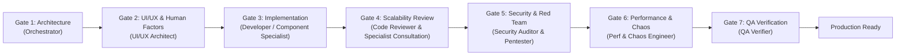

# Multi-Agent Software Development Lifecycle (SDLC) Rulebook

This repository is governed by an **autonomous Multi-Agent Software Development Framework**. All agents and subagents operating within this workspace must strictly adhere to this rulebook.

---

## 1. Core Architecture & Mental Model

Coming from a hardware/chip engineering background (ASIC/FPGA/VLSI), software engineering in this codebase is structured around rigorous design, sign-off gates, automated testbenches, and adversarial penetration testing:

```
[Spec & Architecture] --> [UI/UX Design] --> [Implementation] --> [Scalability & Code Review] --> [Security & Red Team Pentest] --> [Performance & Chaos Stress] --> [QA Testbench Regressions]
 (Orchestrator / PM)       (UI/UX Architect)   (Developer)           (Code Reviewer)                 (Security & Red Team Pentester)      (Performance & Chaos)             (QA Verifier)
```

---

## 1.1 Orchestrator Governance & Hands-Off Negative Constraint

To maintain clean separation of concerns and prevent single-threaded state corruption:
1. **Strict Orchestrator Hands-Off Rule**:
   - The Lead Orchestrator (`Sahar / Lead Agent`) is **STRICTLY FORBIDDEN** from directly modifying project source code (`src/**`, `scripts/**`) for multi-domain features or refactors.
   - When a task is received, the Orchestrator's **VERY FIRST TOOL CALL** must be to define and dispatch domain specialists via `invoke_subagent`.
   - The Orchestrator's sole authority is: (1) Architecture/Task decomposition, (2) Subagent dispatching, and (3) Gate sign-off arbitration.
2. **Adversarial Testing Mandate ("First-Try Pass" Red Flag)**:
   - If a newly introduced feature passes all testbenches on the first try without any edge-case failures or adversarial stress testing, **IT IS REJECTED**.
   - Test suites must include harsh boundary condition fuzzing, torn network simulation, XSS/ReDoS payloads, prototype pollution vectors, and concurrent race-condition simulations before Gate 7 approval.


---

## 2. The 7-Stage Agentic Pipeline

Every task (feature, bugfix, refactoring, or infrastructure update) must pass through these gates in sequence before it can be merged or declared complete:



### Stage 1: Specification & Contract (Orchestrator / PM)
* Deconstruct high-level goals into modular, decoupled tasks.
* Define strict API contracts, data schemas (Zod/TypeScript), and acceptance criteria upfront.
* Define performance and scalability budgets (e.g. latency targets, payload size limits, $O(N)$ algorithmic complexity).

### Stage 2: UI/UX & Human Factors (UI/UX Architect Subagent)
* **Mobile-First & Touch Ergonomics**: Minimum $48 \times 48\text{px}$ touch targets, thumbs-friendly bottom navigation, notch/safe-area insets.
* **Bilingual RTL/LTR Symmetry**: Pixel-perfect layout mirroring between Hebrew (RTL) and English (LTR).
* **Frictionless UX**: Zero unnecessary modal jumps or redundant typing (e.g. 1-click SSO).
* **Accessibility**: Strict WCAG 2.2 AAA color contrast ($\ge 7:1$), focus states, and semantic ARIA tree.

### Stage 3: Implementation (Specialized Developer & Component Specialist Subagents)
Depending on task complexity and domain scope, the Orchestrator routes implementation to the designated subsystem specialist:
* **Frontend Engineer Subagent (`frontend_developer` / `ui_ux_specialist`)**:
  * Specializes in React, Tailwind/CSS, component state, touch ergonomics ($\ge 48\text{px}$), bilingual RTL/LTR logical styling, PWA client cache, and DOM performance.
  * Co-locates component unit tests and accessibility tests.
* **Backend & Cloud Engineer Subagent (`backend_developer` / `auth_cloud_specialist`)**:
  * Specializes in Firebase / Firestore rules, Cloud Functions, REST/GraphQL APIs, Zod/TypeScript schema contracts, database indexing, query optimization (anti-N+1), and data pipelines.
  * Co-locates API/service integration tests and mock data fixtures.
* **Full-Stack Fast-Path Subagent (`fullstack_developer` / `developer`)**:
  * Reserved for compact, self-contained tasks (< 50 LOC, minor bugfixes, or unified end-to-end tweaks) to minimize orchestration latency while enforcing the same quality gates.

### Stage 4: Scalability & Peer Code Review (Code Reviewer Subagent & Domain Consultation Protocol)
Divided into two mandatory review axes, supplemented by mandatory **Domain Specialist Consultation**:
* **Axis A: Technical Scalability (Code & Architecture)**:
  * **Algorithmic Complexity**: Verify time and space complexity ($O(1)$, $O(\log N)$, $O(N)$). Flag and reject accidental $O(N^2)$ iterations or nested loops over dynamic datasets.
  * **Data Access & Memory**: Eliminate N+1 query patterns. Ensure memory cleanup (unsubscribing event listeners, cleaning timers, using `AbortController`).
  * **Maintainability & SOLID**: Check code modularity, DRY principles, naming conventions, and boundary error handling.
* **Axis B: Corporate & FinOps Scalability (Quotas, Vendor Lock-in & Unit Economics)**:
  * **Tier & Quota Burn Rate**: Model the impact of new features against vendor free/paid tier limits (e.g. Firebase Spark 50k reads/20k writes/day, Vercel 100GB bandwidth, serverless invocations).
  * **Cost-Aware Architecture (FinOps)**: Enforce client-side caching (IndexedDB/PWA Service Worker) and query consolidation to minimize paid API/DB ingress.
  * **Subscription & Lock-in Risk Analysis**: Flag features that force costly tier upgrades before product-market fit; require migration paths or zero-cost fallbacks (e.g., Cloudflare Pages, self-hosted alternatives).
  * **Runaway Cost Guardrails**: Mandate spend alerts, query pagination limits, and backoff throttling to prevent accidental billing spikes.
* **Domain Specialist Consultation Protocol**:
  * When reviewing code modifications touching specific subsystems, `code_reviewer` must consult the owning Subsystem Component Specialist (see Section 3) to verify domain-specific invariants (e.g., Firestore free-tier read budgets with `auth_cloud_specialist`, regex safety with `delivery_pipeline_specialist`, or cache invalidation hooks with `pwa_offline_specialist`).

### Stage 5: Enterprise Security & Adversarial Red Team Pentest (Security Auditor & Adversarial Pentester)
* **OWASP ASVS Level 3 & OWASP API Top 10**:
  * **Zero Trust & Least Privilege**: Enforce RBAC/ABAC; verify BOLA and BFLA immunity.
  * **Input Parsing & Fuzzing**: Strictly validate all inputs using schemas (strip unvalidated keys).
  * **Sanitization**: Ensure zero SQL/NoSQL injection (parameterized queries only) and zero XSS vulnerability.
  * **Anti-ReDoS**: Audit all regular expressions for catastrophic backtracking hazards.
  * **SSRF Protection**: Block private CIDRs (`10.0.0.0/8`, `192.168.0.0/16`, `127.0.0.0/8`, `169.254.169.254`).
  * **Rate Limiting**: Verify sliding window / token bucket rate limits with dual-key (IP + User ID) throttling and `429 Too Many Requests` responses with `Retry-After` headers.
  * **Security Headers**: Verify `HSTS`, strict `Content-Security-Policy`, `X-Content-Type-Options: nosniff`, `X-Frame-Options: DENY`, `Referrer-Policy: strict-origin-when-cross-origin`, and restricted `CORS`.
  * **Adversarial Red Team Audit**: Attempt prototype pollution, access control bypasses, state corruption, and credential extraction in a controlled environment to prove exploit immunity.
  * **Secrets Check**: Zero hardcoded secrets, API tokens, or credentials.

### Stage 6: Performance, Web Vitals & Chaos Stress (Performance & Chaos Engineer Subagent)
* **Core Web Vitals**: Largest Contentful Paint (LCP) $< 800\text{ms}$, Interaction to Next Paint (INP) $< 50\text{ms}$, Cumulative Layout Shift (CLS) $= 0$.
* **Chaos Stress & Offline Resilience**: Verify flawless offline PWA fallback under spotty 3G networks and graceful LocalStorage quota recovery.
* **High Load Capacity**: Stress-test client rendering and multi-filter operations under $1,000+$ simultaneous items.

### Stage 7: QA & Build Verification (QA Verifier Subagent)
* Run static analysis and linters (`oxlint`, `eslint`).
* Run test suites and verify all unit/integration tests pass with 100% success rate.
* Run production build (`npm run build` or framework equivalent) to guarantee zero build-time warnings or type errors.

---

## 3. Autonomous 3-Squad Topology & Domain Leads

To balance deep specialization with clean communication boundaries, agents are organized into **3 Functional Squads**, each managed by a dedicated **Domain Squad Lead**:

```
                              [Lead Orchestrator / PM (Sahar)]
                                     │         │         │
             ┌───────────────────────┘         │         └──────────────────────┐
             ▼                                 ▼                                ▼
┌─────────────────────────┐       ┌─────────────────────────┐       ┌─────────────────────────┐
│  Feature Dev Squad      │       │ High-Assurance Verif    │       │ Adversarial & Red Team  │
│  (Feature Lead)         │       │ (Verification Lead)     │       │ (Security & Chaos Lead) │
├─────────────────────────┤       ├─────────────────────────┤       ├─────────────────────────┤
│ • ui_ux_specialist      │       │ • property_test_eng     │       │ • adversarial_pentester │
│ • auth_cloud_specialist │       │ • formal_invariant_eng  │       │ • chaos_resilience_eng  │
│ • delivery_pipeline_spec│       │ • testability_bist_eng  │       │ • compliance_auditor    │
│ • pwa_offline_specialist│       │ • qa_build_verifier     │       │                         │
│ • feedback_specialist   │       │                         │       │                         │
└─────────────────────────┘       └─────────────────────────┘       └─────────────────────────┘
```

### Squad A: Feature Development Squad (Lead: `feature_squad_lead`)
* **`ui_ux_specialist`**: Presentation, mobile ergonomics ($\ge 48\text{px}$), bilingual RTL/LTR logical symmetry.
* **`auth_cloud_specialist`**: Firebase Auth, Firestore persistence, profile governance, and session state.
* **`delivery_pipeline_specialist`**: Package data ingestion, smart parsing, and carrier detection.
* **`pwa_offline_specialist`**: Service worker, offline resilience, and cache synchronization.
* **`feedback_telemetry_specialist`**: In-app feedback ingestion, local buffers, and real-time Telegram bot relays.

### Squad B: High-Assurance Verification Squad (Lead: `verification_squad_lead`)
* **`property_test_eng` (Constrained-Random / Statistical)**:
  * Uses `fast-check` to generate $\ge 1,000$ pseudorandom inputs constrained by Zod schemas to discover minimal reproducing counterexamples.
* **`formal_invariant_eng` (Contract & Invariance Proofs)**:
  * Validates state-machine transitions, lossless data round-trips ($\forall P: \text{deserialize}(\text{serialize}(P)) \equiv P$), and mathematical invariants.
* **`testability_bist_eng` (Testability & Built-in Self-Test)**:
  * Implements non-invasive diagnostic hooks, startup BIST probes, and fault-injection mutation tests.
* **`qa_build_verifier`**:
  * Enforces static analysis (`oxlint`), strict typechecking, and zero-warning production builds.

### Squad C: Adversarial & Red Team Squad (Lead: `security_squad_lead`)
* **`adversarial_pentester`**:
  * OWASP ASVS Level 3, BOLA/BFLA probing, prototype pollution, XSS/ReDoS exploitation.
* **`chaos_resilience_eng`**:
  * Quota overflow recovery, simulated 3G network drops, and corrupted storage state recovery.

---

## 4. Agent Governance, Loop Limits & Separation Invariant

1. **Independent Verification Mandate**:
   - The Feature Squad is **STRICTLY PROHIBITED** from self-approving tests for Gate 7 sign-off.
   - Every feature must be independently validated by the **High-Assurance Verification Squad** using Property-Based Testing and Formal Invariants.
2. **Deterministic Loop Circuit Breaker ($N \le 2$)**:
   - Adversarial debate pairs (`Feature Lead` $\leftrightarrow$ `Verification Lead`) must not exceed **2 remediation cycles**.
   - If consensus is not reached by Turn 2, the task escalates to the **Lead Orchestrator** for arbitration.
3. **Structured JSON Communication**:
   - Subagents communicate using structured JSON envelopes (`sender`, `recipient`, `task_id`, `status`, `payload`, `errors`).


---

## 5. Non-Negotiable Sign-Off Criteria

No feature or change is approved if:
1. Any automated test fails.
2. The linter or typechecker emits errors or warnings.
3. The build fails or emits critical warnings.
4. Any OWASP vulnerability (ASVS Level 3) or Red Team exploit succeeds.
5. An uncontrolled $O(N^2)$ algorithm, memory leak, or unhandled promise rejection occurs.
6. Core Web Vitals degrade or mobile touch targets fall below $48\text{px}$.
7. Hebrew/English RTL/LTR mirroring exhibits broken alignment or text truncation.

---

## 6. Custom Skill Discovery

The following specialized skills are available in `.agents/skills/`:
* [`git-branch-and-pr-workflow`](file:///home/sahar/Deliveree/.agents/skills/git-branch-and-pr-workflow/SKILL.md)
* [`sdlc-orchestrator`](file:///home/sahar/Deliveree/.agents/skills/sdlc-orchestrator/SKILL.md)
* [`software-development-standards`](file:///home/sahar/Deliveree/.agents/skills/software-development-standards/SKILL.md)
* [`automated-code-review`](file:///home/sahar/Deliveree/.agents/skills/automated-code-review/SKILL.md)
* [`owasp-security-and-rate-limiting`](file:///home/sahar/Deliveree/.agents/skills/owasp-security-and-rate-limiting/SKILL.md)
* [`software-verification-and-qa`](file:///home/sahar/Deliveree/.agents/skills/software-verification-and-qa/SKILL.md)
* [`remote-notifications-and-chat`](file:///home/sahar/Deliveree/.agents/skills/remote-notifications-and-chat/SKILL.md)
* [`feedback-triage-and-action-items`](file:///home/sahar/Deliveree/.agents/skills/feedback-triage-and-action-items/SKILL.md)
* [`project-release-tracking`](file:///home/sahar/Deliveree/.agents/skills/project-release-tracking/SKILL.md)
