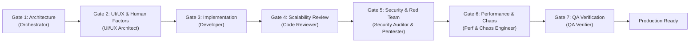

# Multi-Agent Software Development Lifecycle (SDLC) Rulebook

This repository is governed by an **autonomous Multi-Agent Software Development Framework**. All agents and subagents operating within this workspace must strictly adhere to this rulebook.

---

## 1. Core Architecture & Mental Model

Coming from a hardware/chip engineering background (ASIC/FPGA/VLSI), software engineering in this codebase is structured around rigorous design, sign-off gates, automated testbenches, and adversarial penetration testing:

```
[Spec & Architecture] --> [UI/UX Design] --> [Implementation] --> [Scalability & Code Review] --> [Security & Red Team Pentest] --> [Performance & Chaos Stress] --> [QA Testbench Regressions]
 (Orchestrator / PM)       (UI/UX Architect)   (Developer)           (Code Reviewer)                 (Security & Red Team Pentester)      (Performance & Chaos)             (QA Verifier)
```

---

## 2. The 7-Stage Agentic Pipeline

Every task (feature, bugfix, refactoring, or infrastructure update) must pass through these gates in sequence before it can be merged or declared complete:



### Stage 1: Specification & Contract (Orchestrator / PM)
* Deconstruct high-level goals into modular, decoupled tasks.
* Define strict API contracts, data schemas (Zod/TypeScript), and acceptance criteria upfront.
* Define performance and scalability budgets (e.g. latency targets, payload size limits, $O(N)$ algorithmic complexity).

### Stage 2: UI/UX & Human Factors (UI/UX Architect Subagent)
* **Mobile-First & Touch Ergonomics**: Minimum $48 \times 48\text{px}$ touch targets, thumbs-friendly bottom navigation, notch/safe-area insets.
* **Bilingual RTL/LTR Symmetry**: Pixel-perfect layout mirroring between Hebrew (RTL) and English (LTR).
* **Frictionless UX**: Zero unnecessary modal jumps or redundant typing (e.g. 1-click SSO).
* **Accessibility**: Strict WCAG 2.2 AAA color contrast ($\ge 7:1$), focus states, and semantic ARIA tree.

### Stage 3: Implementation (Developer Subagent)
* Implement the designated component following **Clean Architecture** and **Single Responsibility**.
* Co-locate unit tests alongside implementation files (e.g. `*.test.js`, `*.test.jsx`, `*.test.ts`).
* Write defensive, strongly typed, self-documenting code. Never use implicit `any` or suppress linter errors.

### Stage 4: Scalability & Peer Code Review (Code Reviewer Subagent)
* **Algorithmic Complexity**: Verify time and space complexity ($O(1)$, $O(\log N)$, $O(N)$). Flag and reject accidental $O(N^2)$ iterations or nested loops over dynamic datasets.
* **Data Access & Memory**: Eliminate N+1 query patterns. Ensure memory cleanup (unsubscribing event listeners, cleaning timers, using `AbortController`).
* **Maintainability & SOLID**: Check code modularity, DRY principles, naming conventions, and boundary error handling.

### Stage 5: Enterprise Security & Adversarial Red Team Pentest (Security Auditor & Adversarial Pentester)
* **OWASP ASVS Level 3 & OWASP API Top 10**:
  * **Zero Trust & Least Privilege**: Enforce RBAC/ABAC; verify BOLA and BFLA immunity.
  * **Input Parsing & Fuzzing**: Strictly validate all inputs using schemas (strip unvalidated keys).
  * **Sanitization**: Ensure zero SQL/NoSQL injection (parameterized queries only) and zero XSS vulnerability.
  * **Anti-ReDoS**: Audit all regular expressions for catastrophic backtracking hazards.
  * **SSRF Protection**: Block private CIDRs (`10.0.0.0/8`, `192.168.0.0/16`, `127.0.0.0/8`, `169.254.169.254`).
  * **Rate Limiting**: Verify sliding window / token bucket rate limits with dual-key (IP + User ID) throttling and `429 Too Many Requests` responses with `Retry-After` headers.
  * **Security Headers**: Verify `HSTS`, strict `Content-Security-Policy`, `X-Content-Type-Options: nosniff`, `X-Frame-Options: DENY`, `Referrer-Policy: strict-origin-when-cross-origin`, and restricted `CORS`.
  * **Adversarial Red Team Audit**: Attempt prototype pollution, access control bypasses, state corruption, and credential extraction in a controlled environment to prove exploit immunity.
  * **Secrets Check**: Zero hardcoded secrets, API tokens, or credentials.

### Stage 6: Performance, Web Vitals & Chaos Stress (Performance & Chaos Engineer Subagent)
* **Core Web Vitals**: Largest Contentful Paint (LCP) $< 800\text{ms}$, Interaction to Next Paint (INP) $< 50\text{ms}$, Cumulative Layout Shift (CLS) $= 0$.
* **Chaos Stress & Offline Resilience**: Verify flawless offline PWA fallback under spotty 3G networks and graceful LocalStorage quota recovery.
* **High Load Capacity**: Stress-test client rendering and multi-filter operations under $1,000+$ simultaneous items.

### Stage 7: QA & Build Verification (QA Verifier Subagent)
* Run static analysis and linters (`oxlint`, `eslint`).
* Run test suites and verify all unit/integration tests pass with 100% success rate.
* Run production build (`npm run build` or framework equivalent) to guarantee zero build-time warnings or type errors.

---

## 3. Non-Negotiable Sign-Off Criteria

No feature or change is approved if:
1. Any automated test fails.
2. The linter or typechecker emits errors or warnings.
3. The build fails or emits critical warnings.
4. Any OWASP vulnerability (ASVS Level 3) or Red Team exploit succeeds.
5. An uncontrolled $O(N^2)$ algorithm, memory leak, or unhandled promise rejection occurs.
6. Core Web Vitals degrade or mobile touch targets fall below $48\text{px}$.
7. Hebrew/English RTL/LTR mirroring exhibits broken alignment or text truncation.

---

## 4. Custom Skill Discovery

The following specialized skills are available in `.agents/skills/`:
* [`sdlc-orchestrator`](file:///home/sahar/Deliveree/.agents/skills/sdlc-orchestrator/SKILL.md)
* [`software-development-standards`](file:///home/sahar/Deliveree/.agents/skills/software-development-standards/SKILL.md)
* [`automated-code-review`](file:///home/sahar/Deliveree/.agents/skills/automated-code-review/SKILL.md)
* [`owasp-security-and-rate-limiting`](file:///home/sahar/Deliveree/.agents/skills/owasp-security-and-rate-limiting/SKILL.md)
* [`software-verification-and-qa`](file:///home/sahar/Deliveree/.agents/skills/software-verification-and-qa/SKILL.md)
* [`remote-notifications-and-chat`](file:///home/sahar/Deliveree/.agents/skills/remote-notifications-and-chat/SKILL.md)
