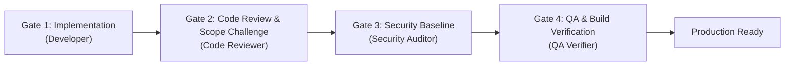

# Base44 Dev Environment

- **Stack**: React 19 + Vite 8 PWA ("deliveree" package-tracking app), client-only. Tailwind v4, Firebase (Auth + Firestore), Zod.
- **Run**: `docker compose -f docker-compose.base44.yml up -d` — single `web` service (node:22) bind-mounts the repo, runs `npm install && npm run dev`, maps host port 3000 → container 5173. Vite live-reloads edits.
- **No external secrets required to boot**: Firebase config (`src/services/firebase.js`) ships working defaults inline (client-side public API key, restricted via Firebase Console). Optional `VITE_TELEGRAM_FEEDBACK_BOT_TOKEN` / `VITE_TELEGRAM_FEEDBACK_CHAT_ID` power the feedback relay but are not needed to run/preview.
- **Verify**: `curl -sf -H "Host: external-preview.example.com" http://localhost:3000/` returns 200 with the Vite dev HTML (serves unhashed `/src/main.jsx`, not a prebuilt bundle). Healthcheck hits `127.0.0.1:5173`.
- **Tests**: `npm test` (vitest), `npm run lint` (oxlint), `npm run build` (vite build).

---

# Multi-Agent Software Development Lifecycle (SDLC) Rulebook

This repository is governed by an **autonomous Multi-Agent Software Development Framework**. All agents and subagents operating within this workspace must strictly adhere to this rulebook.

---

## 1. Core Architecture & Mental Model

Software engineering in this codebase is structured around rigorous design, distinct sign-off gates, automated testbenches, and client-side security baselines:

```
[Spec & Architecture] --> [UI/UX Design] --> [Implementation] --> [Scalability & Code Review] --> [Security Baseline Audit] --> [QA Verification]
 (Lead Orchestrator)      (UI/UX Architect)     (Developer)              (Code Reviewer)              (Security Auditor)          (QA Verifier)
```

---

## 1.1 Orchestrator Governance & Separation Invariant

To maintain clean separation of concerns:
1. **Strict Orchestrator Hands-Off Rule**:
   - The Lead Orchestrator is **STRICTLY FORBIDDEN** from directly modifying project source code (`src/**`, `scripts/**`) for multi-domain features or refactors.
   - The Orchestrator's sole authority is: (1) Architecture/Task decomposition, (2) Subagent dispatching, and (3) Gate sign-off arbitration.
2. **Distinct Verification Gates**:
   - Code Review, Security Audit, and QA Verification **MUST ALWAYS** be executed by distinct subagents. Self-review by the Orchestrator or authoring subagent is strictly forbidden.
3. **Standard Capped Pipeline**:
   - Routine development flows through the standard 4 gates (**Developer → Code Reviewer → Security Auditor → QA Verifier → Done**).
   - Extra adversarial swarms (challengers/forensic auditors) are reserved strictly for meta-layer framework restructures, not routine application features.

---

## 2. The Standard Quality Gate Pipeline



### Stage 1: Specification & Contract (Lead Orchestrator)
* Deconstruct high-level goals into modular tasks and interfaces.
* Define strict API contracts, data schemas (Zod/TypeScript), and acceptance criteria upfront.
* Define performance budgets ($O(N)$ algorithmic complexity, memory bounds).

### Stage 2: UI/UX & Human Factors (UI/UX Architect Subagent)
* **Mobile-First & Touch Ergonomics**: Minimum $48 \times 48\text{px}$ touch targets, thumb-friendly navigation, notch/safe-area insets.
* **Bilingual RTL/LTR Symmetry**: Pixel-perfect layout mirroring between Hebrew (RTL) and English (LTR) using CSS logical properties.
* **Accessibility**: Strict WCAG 2.2 AAA color contrast, focus states, and semantic ARIA tree.

### Stage 3: Implementation (Developer & Component Specialists)
* **`developer` / `ui_ux_specialist` / `auth_cloud_specialist` / `delivery_pipeline_specialist` / `pwa_offline_specialist`**:
  * Follow Clean Architecture: decouple Presentation, Domain Logic, and Storage Adapters.
  * Co-locate unit tests alongside implementation (`*.test.jsx`, `*.test.js`).
  * Guard cloud free-tier quotas (Firebase Spark read/write budgets, IndexedDB client caching).

### Stage 4: Scalability & Peer Code Review (Code Reviewer Subagent)
* **Scope Challenge (Mandatory)**: Before flagging an issue, state in one line why it matters *for this specific app at its current stage*. Non-blocking items are logged to `DEFERRED.md`.
* **Algorithmic Complexity**: Verify $O(1)$ or $O(N)$ operations. Flag nested loop lookups ($O(N^2)$) and quadratic spreads.
* **Memory & Lifecycle**: Verify explicit cleanup of timers, event listeners, and `AbortController` instances on unmount.
* **Specialist Consultation**: Check domain-specific invariants for Auth, Delivery, UI/UX, and PWA files.

### Stage 5: Security Baseline Audit (Security Auditor Subagent)
* **Deliveree Security Baseline (Client-Only PWA)**:
  * *Re-adopt ASVS L2/L3 language only if/when a real backend or auth server is introduced.*
  * **Firestore BOLA Invariant**: Rule `update` must enforce `resource.data.userId == auth.uid && request.resource.data.userId == auth.uid`.
  * **Anti-ReDoS**: Deterministic regex patterns without nested unanchored quantifiers.
  * **Input Parsing**: Strict schema allowlisting (Zod `strip()`) and prototype pollution guards.
  * **Client Web APIs**: Safe `FileReader` limits ($\le 2\text{MB}$) and clipboard fallback.
  * **Secrets Check**: Zero hardcoded credentials or API keys in source files or client bundles.

### Stage 6: QA & Build Verification (QA Verifier Subagent)
* Static analysis: `oxlint -D warnings --deny-warnings`
* Typecheck: `tsc --noEmit --strict`
* 5-Tier Testbench: `npm test` (100% pass rate)
* Anti-facade scan: Verify zero dummy assertions (`expect(true).toBe(true)`) or skipped tests (`it.skip`).
* Production build: `npm run build` (zero build warnings or errors).

---

## 3. Autonomous Subsystem Specialists

Domain specialists own and maintain invariants for specific subsystems:
- **`auth_cloud_specialist`**: AuthContext, Firebase Auth state, Firestore security rules, Spark quota optimizations.
- **`delivery_pipeline_specialist`**: Package lifecycle, Zod schema validation, carrier detection regexes, smartParser.
- **`ui_ux_specialist`**: Layout, mobile touch targets ($\ge 48\text{px}$), Hebrew RTL / English LTR symmetry.
- **`pwa_offline_specialist`**: Service worker, offline resilience, and cache synchronization.
- **`feedback_telemetry_specialist`**: Feedback modal, Firestore feedback, Telegram bot relays.

---

## 4. Governance, Remediation & Circuit Breaker

1. **Independent Verification**: Authoring agents are strictly prohibited from approving their own reviews or verification gates.
2. **Bounded Remediation ($N \le 3$)**:
   - Failing gates are returned to the developer with exact file, line, and remediation instructions.
   - Maximum 3 retries per gate before logging the failure to `DEAD_ENDS.md` and escalating to the user.
3. **Structured JSON Communication**: Subagents communicate using structured envelopes.

---

## 5. Non-Negotiable Sign-Off Criteria

No feature or change is approved if:
1. Any automated test fails.
2. The linter or typechecker emits errors or warnings.
3. The build fails or emits critical errors.
4. Any Deliveree Security Baseline vulnerability is detected.
5. An uncontrolled $O(N^2)$ algorithm or memory leak is introduced.
6. Mobile touch targets fall below $48\text{px}$ or RTL/LTR mirroring is broken.

---

## 6. Custom Skill Discovery

The specialized skills governing this workspace are located in `.agents/skills/`:
* [`git-branch-and-pr-workflow`](.agents/skills/git-branch-and-pr-workflow/SKILL.md)
* [`sdlc-orchestrator`](.agents/skills/sdlc-orchestrator/SKILL.md)
* [`software-development-standards`](.agents/skills/software-development-standards/SKILL.md)
* [`automated-code-review`](.agents/skills/automated-code-review/SKILL.md)
* [`owasp-security-and-rate-limiting`](.agents/skills/owasp-security-and-rate-limiting/SKILL.md)
* [`software-verification-and-qa`](.agents/skills/software-verification-and-qa/SKILL.md)
* [`remote-notifications-and-chat`](.agents/skills/remote-notifications-and-chat/SKILL.md)
* [`feedback-triage-and-action-items`](.agents/skills/feedback-triage-and-action-items/SKILL.md)
* [`project-release-tracking`](.agents/skills/project-release-tracking/SKILL.md)
