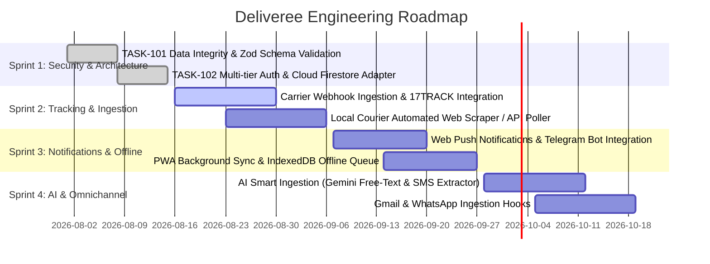

# Deliveree Engineering Roadmap & Sprint Plan

## 1. Product Vision
Deliveree is a modern, privacy-conscious, multi-carrier package tracking PWA designed for the Israeli and global e-commerce consumer. It unifies order updates across Israeli couriers (Israel Post, Cheetah, HFD, BoxIt) and global shipping networks (AliExpress Cainiao, YunExpress, 4PX, DHL, FedEx, UPS, USPS, Royal Mail, Aramex, Yanwen) into an intuitive, bilingual (Hebrew RTL / English LTR), cloud-synchronized experience.

---

## 2. Sprint Roadmap

---

### Sprint 1: Architecture & Security Hardening (Completed)
- [x] **TASK-101: Data Integrity & Schema Validation Layer**
  - Implemented runtime Zod validation schemas (`checkpointSchema`, `packageSchema`, `packageListSchema`) in [`src/schemas/packageSchema.js`](file:///home/sahar/Deliveree/src/schemas/packageSchema.js).
  - Sanitized untrusted inputs, stripped unknown properties, and mitigated prototype pollution attacks (`__proto__`, `constructor`, `prototype`).
  - Added unit test suite [`src/schemas/packageSchema.test.js`](file:///home/sahar/Deliveree/src/schemas/packageSchema.test.js).
- [x] **TASK-102: Multi-Tier Authentication & Firestore Adapter**
  - Implemented [`src/services/cloudStorageAdapter.js`](file:///home/sahar/Deliveree/src/services/cloudStorageAdapter.js) with real-time Firestore listeners, batch commit synchronization, and graceful LocalStorage fallback.
  - Implemented [`src/context/AuthContext.jsx`](file:///home/sahar/Deliveree/src/context/AuthContext.jsx) with secure error mapping (preventing CWE-209 data leakage) and validated profile storage.
  - Enforced per-user security boundary in [`firestore.rules`](file:///home/sahar/Deliveree/firestore.rules).

---

### Sprint 2: Multi-Carrier Auto-Tracking & Webhook Ingestion
- [ ] **Automated Multi-Carrier Polling Service**
  - Integrate unified tracking APIs (17TRACK / Ship24 / Cainiao Global API) for real-time checkpoint updates.
  - Periodic background polling for active packages in `in_transit`, `customs`, and `out_for_delivery` states.
- [ ] **Israeli Couriers Direct Parsers**
  - Add specialized scrapers and direct API clients for Israel Post, Cheetah Delivery, HFD, and BoxIt locker status.
- [ ] **Inbound Webhook Hub**
  - Firebase Cloud Functions / Serverless webhook endpoint receiving real-time carrier status pushes.
  - Atomic upserts into Firestore `users/{uid}/packages` triggering real-time UI synchronization.

---

### Sprint 3: Smart Notification & PWA Offline Optimization
- [ ] **Multi-Channel Push Notifications**
  - Web Push Notifications API via Service Worker for checkpoint changes (e.g., "Out for delivery", "Arrived at customs").
  - Optional Telegram Bot notification bridge connecting user accounts to Instant Messenger updates.
- [ ] **Advanced PWA Offline Storage**
  - Migrate local storage mirror to IndexedDB using Dexie.js / idb-keyval for unbounded package history and checkpoint caching.
  - Service Worker background sync for mutations performed while offline.

---

### Sprint 4: AI Smart Ingestion & Gmail Integration
- [ ] **Gemini-Powered Smart Ingestion Engine**
  - Extract tracking numbers, carrier names, merchant metadata, and product titles from raw SMS, WhatsApp delivery alerts, and order emails.
- [ ] **Gmail Ingestion Integration**
  - OAuth Google Workspace integration scanning order confirmation and shipment notification emails with zero user friction.
- [ ] **Inbound Email Parser**
  - Dedicated inbound routing (`user.pkg@in.deliveree.app`) auto-parsing forwarded delivery emails.

---

## 3. Quality Gates & Definition of Done (DoD)

All deliverables must satisfy the following criteria before merging:
1. **Type Safety & Schema Integrity**:
   - TypeScript definitions up to date in [`src/types/deliveree.d.ts`](file:///home/sahar/Deliveree/src/types/deliveree.d.ts).
   - Strict runtime validation with Zod schemas in [`src/schemas/packageSchema.js`](file:///home/sahar/Deliveree/src/schemas/packageSchema.js).
2. **Defensive Coding & Security**:
   - Input sanitization against XSS, HTML injection, and prototype pollution.
   - Auth error sanitization preventing internal error code/stack leakage.
   - Firestore security rules guaranteeing strict per-user authorization (`request.auth.uid == userId`).
3. **Automated Testing**:
   - Unit tests co-located next to implementation files (`*.test.js` / `*.test.jsx`).
   - 100% pass rate on Vitest test suite (`npm test`).
4. **Performance & Build Verification**:
   - Zero ESLint / build errors on `npm run build`.
   - Lighthouse score > 90 on Performance, Accessibility, and PWA metrics.
