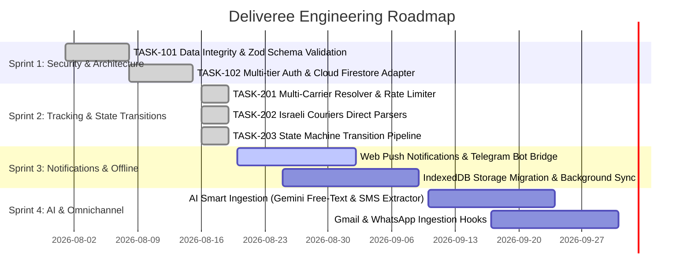

# Deliveree Engineering Roadmap & Sprint Plan

## 1. Product Vision
Deliveree is a modern, privacy-conscious, multi-carrier package tracking PWA designed for the Israeli and global e-commerce consumer. It unifies order updates across Israeli couriers (Israel Post, Cheetah, HFD, BoxIt) and global shipping networks (AliExpress Cainiao, YunExpress, 4PX, DHL, FedEx, UPS, USPS, Royal Mail, Aramex, Yanwen) into an intuitive, bilingual (Hebrew RTL / English LTR), cloud-synchronized experience.

---

## 2. Sprint Roadmap

---

### Sprint 1: Architecture & Security Hardening (Completed — v0.2.1)
- [x] **TASK-101: Data Integrity & Schema Validation Layer**
  - Implemented runtime Zod validation schemas (`checkpointSchema`, `packageSchema`, `packageListSchema`) in [`src/schemas/packageSchema.js`](file:///home/sahar/Deliveree/src/schemas/packageSchema.js).
  - Sanitized untrusted inputs, stripped unknown properties, and mitigated prototype pollution attacks (`__proto__`, `constructor`, `prototype`).
  - Added unit test suite [`src/schemas/packageSchema.test.js`](file:///home/sahar/Deliveree/src/schemas/packageSchema.test.js).
- [x] **TASK-102: Multi-Tier Authentication & Firestore Adapter**
  - Implemented [`src/services/cloudStorageAdapter.js`](file:///home/sahar/Deliveree/src/services/cloudStorageAdapter.js) with real-time Firestore listeners, batch commit synchronization, and graceful LocalStorage fallback.
  - Implemented [`src/context/AuthContext.jsx`](file:///home/sahar/Deliveree/src/context/AuthContext.jsx) with secure error mapping (preventing CWE-209 data leakage) and validated profile storage.
  - Enforced per-user security boundary in [`firestore.rules`](file:///home/sahar/Deliveree/firestore.rules).

---

### Sprint 2: Multi-Carrier Auto-Tracking & State Transitions (Completed — v0.2.2)
- [x] **TASK-201: Multi-Carrier Resolution Engine & Rate-Limiting Cache**
  - Built [`src/services/trackingService.js`](file:///home/sahar/Deliveree/src/services/trackingService.js) with normalized checkpoint mapping conforming to [`checkpointSchema`](file:///home/sahar/Deliveree/src/schemas/packageSchema.js#L23).
  - Implemented 60-second cooldown rate-limiting per package with memory-bounded LRU eviction cache (`MAX_COOLDOWN_MAP_SIZE = 1000`).
  - Implemented concurrency-throttled batch refresh (`batchRefreshTracking`) with progress tracking and toast alerts.
- [x] **TASK-202: Israeli & Global Couriers Direct Parsers**
  - Added specialized parsers and checkpoint normalization for Israeli couriers (Israel Post, Cheetah Delivery, HFD, BoxIt) and Global shipping networks (AliExpress Cainiao, YunExpress, 4PX, DHL, FedEx, UPS, USPS, Royal Mail, Aramex, Yanwen).
- [x] **TASK-203: State Machine Transition Pipeline & UI Controls**
  - Implemented transition matrix enforcement in [`src/services/deliveryService.js`](file:///home/sahar/Deliveree/src/services/deliveryService.js#L13) rejecting invalid state regressions.
  - Added individual and batch refresh actions in [`PackageCard.jsx`](file:///home/sahar/Deliveree/src/components/PackageCard.jsx), [`PackageDetailModal.jsx`](file:///home/sahar/Deliveree/src/components/PackageDetailModal.jsx), and [`FilterBar.jsx`](file:///home/sahar/Deliveree/src/components/FilterBar.jsx) with loading indicators and manual override selector.

---

### Sprint 3: Smart Notifications & PWA Offline Optimization (Next Up)
- [ ] **Multi-Channel Push Notifications & User Alerts**
  - Web Push Notifications API via Service Worker for checkpoint status updates (e.g. "Out for delivery", "Arrived at customs").
  - User Telegram Notification Bridge connecting user accounts to real-time status alerts via Telegram Bot.
- [ ] **Advanced PWA Offline Storage (IndexedDB Migration)**
  - Migrate LocalStorage mirror to IndexedDB (`idb-keyval` / `Dexie.js`) for unbounded checkpoint history and fast query indexing.
  - Service Worker Background Sync API for queuing package creation and checkpoint updates while offline.

---

### Sprint 4: AI Smart Ingestion & Gmail Integration
- [ ] **Gemini-Powered Smart Ingestion Engine**
  - Extract tracking numbers, carrier names, merchant metadata, and product titles from raw SMS, WhatsApp delivery alerts, and order emails.
- [ ] **Gmail Ingestion Integration**
  - OAuth Google Workspace integration scanning order confirmation and shipment notification emails with zero user friction.
- [ ] **Inbound Email Parser**
  - Dedicated inbound routing (`user.pkg@in.deliveree.app`) auto-parsing forwarded delivery emails.

---

## 3. Quality Gates & Definition of Done (DoD)

All deliverables must satisfy the following criteria before merging:
1. **Type Safety & Schema Integrity**:
   - TypeScript definitions up to date in [`src/types/deliveree.d.ts`](file:///home/sahar/Deliveree/src/types/deliveree.d.ts).
   - Strict runtime validation with Zod schemas in [`src/schemas/packageSchema.js`](file:///home/sahar/Deliveree/src/schemas/packageSchema.js).
2. **Defensive Coding & Security**:
   - Input sanitization against XSS, HTML injection, and prototype pollution.
   - Auth error sanitization preventing internal error code/stack leakage.
   - Firestore security rules guaranteeing strict per-user authorization (`request.auth.uid == userId`).
3. **Automated Testing**:
   - Unit tests co-located next to implementation files (`*.test.js` / `*.test.jsx`).
   - 100% pass rate on Vitest test suite (`npm test`).
4. **Performance & Build Verification**:
   - Zero ESLint / build errors on `npm run build`.
   - Lighthouse score > 90 on Performance, Accessibility, and PWA metrics.
