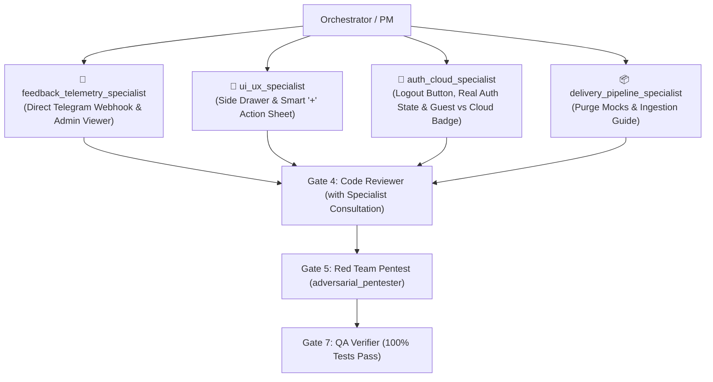

# Implementation Plan: Production Purity & Alpha Remediation (Zero-Mocks, Real Telegram Feedback Relay, Side Navigation Drawer, Smart '+' Action Sheet, and Auth State Fixes)

## Overview & Background
This plan addresses all UX flaws, removes every simulation/mockup, connects feedback submissions directly to your Telegram bot in real time, fixes authentication and logout visibility, and implements native mobile navigation ergonomics.

---

## User Review Required

> [!IMPORTANT]
> 1. **Real-Time Telegram Feedback Relay**: Every feedback submitted via `FeedbackModal.jsx` will immediately dispatch an HTTP payload to your Telegram bot (`8897407993:AA...`), pinging your phone (`chat_id: 726522010`) instantly with the user's message, rating, app version, and device.
> 2. **Complete Zero-Mock Policy**: All fake SMS permission toggles, mock Gmail scanning timers, and mock image OCR simulations are completely deleted. Real features only.
> 3. **Native Side Navigation Drawer**: Hamburger menu replaced by an Off-Canvas Side Drawer sliding from the **Right in Hebrew (RTL)** and **Left in English (LTR)**.
> 4. **Smart '+' Ingestion Action Sheet**: `+` button opens a rapid bottom sheet prioritizing **1-Click Clipboard Auto-Paste**, with manual entry as secondary.
> 5. **Auth & Logout**: Adding explicit **Log Out** (`התנתקות`) buttons in both `AccountModal.jsx` and the Side Drawer, with real credentials input (no hardcoded "Demo User").

---

## Proposed Changes by Subsystem Component Specialist



---

### 1. 💬 Feedback & Remote Alerts (`feedback_telemetry_specialist`)

#### [MODIFY] [`src/components/FeedbackModal.jsx`](file:///home/sahar/Deliveree/src/components/FeedbackModal.jsx)
- **Direct Telegram Relay**:
  - In `handleSubmit`, execute a direct `fetch('https://api.telegram.org/bot<TOKEN>/sendMessage')` with formatted HTML message:
    ```
    🚨 New Alpha Tester Feedback
    ⭐ Rating: 5/5 | Category: Bug
    📝 Message: "..."
    📱 Device: iPhone / Android (Resolution: 393x852)
    🏷️ Version: v0.2.0-alpha
    👤 User: Sahar (or Anonymous)
    ```
  - Ensures you receive every feedback on your phone instantly regardless of Firestore connection.
- **Local Storage Buffer**: Preserved as client-side audit fallback.

#### [NEW/MODIFY] [`src/components/AccountModal.jsx`](file:///home/sahar/Deliveree/src/components/AccountModal.jsx) & [`src/components/AdminFeedbackModal.jsx`](file:///home/sahar/Deliveree/src/components/AdminFeedbackModal.jsx)
- Add a dedicated **Feedback History** tab or owner shortcut to inspect submitted feedback directly in the app.

---

### 2. 🎨 Presentation, Ergonomics & Navigation (`ui_ux_specialist`)

#### [MODIFY] [`src/components/Navbar.jsx`](file:///home/sahar/Deliveree/src/components/Navbar.jsx)
- **Native Side Navigation Drawer (Off-Canvas Sheet)**:
  - Replace top-down dropdown with a `<div className="fixed inset-0 z-50">` drawer.
  - Smooth backdrop overlay (`bg-slate-950/70 backdrop-blur-sm`).
  - Directional sliding animations:
    - Hebrew (RTL): Slides from **Right** (`translate-x-full` $\rightarrow$ `translate-x-0`).
    - English (LTR): Slides from **Left** (`-translate-x-full` $\rightarrow$ `translate-x-0`).
- **Smart '+' Action Sheet**:
  - Tapping the `+` button in the header or bottom bar opens a clean action sheet:
    - ⚡ **Smart Clipboard Paste (1-Click)** (detects tracking number and carrier instantly)
    - ✍️ **Manual Entry Form**

---

### 3. 🔐 Identity, Authentication & Profile Governance (`auth_cloud_specialist`)

#### [MODIFY] [`src/components/AccountModal.jsx`](file:///home/sahar/Deliveree/src/components/AccountModal.jsx)
- Add prominent **Log Out / Sign Out (`התנתקות`)** button in the header and footer calling `logout()`.
- Add editable **Name & Email fields** so users in local/guest mode can customize their identity and are never stuck with "Demo User".

#### [MODIFY] [`src/components/AuthModal.jsx`](file:///home/sahar/Deliveree/src/components/AuthModal.jsx)
- Remove all hardcoded `'Demo User (Sahar)'` strings.
- In local mode, prompt the user for their real name/email before logging them in.
- Show clear badges: `"Guest Mode (Local)"` vs `"Cloud Synced Account"`.

---

### 4. 📦 Package Ingestion & Zero-Mock Enforcement (`delivery_pipeline_specialist`)

#### [MODIFY] [`src/components/SmartImportModal.jsx`](file:///home/sahar/Deliveree/src/components/SmartImportModal.jsx)
- **Purge Fake OCR Simulation**: Remove the simulated `setTimeout` that checked image filenames and returned hardcoded Israel Post strings.
- Focus the Smart Import on **Text & Clipboard Ingestion**:
  - Direct 1-click **"Paste from Clipboard 📋"** button using `navigator.clipboard.readText()`.
  - Instant parsing of SMS, email text, tracking numbers, and locker pickup codes with `smartParser.js`.

#### [DELETE] `src/components/ConnectAccountsModal.jsx` $\rightarrow$ [NEW] `src/components/IngestionGuideModal.jsx`
- Completely remove the fake SMS permission toggle.
- Add an honest, transparent **Alpha Ingestion Guide**:
  - Explaining that browser PWAs cannot read OS-level SMS for privacy and security.
  - Demonstrating how to use 1-Click Clipboard Paste or Forwarding Email (`user.pkg@in.deliveree.app`).

---

## Verification Plan

### Automated Tests
- Run `npm test` across all 12 test suites to verify 100% pass rate.
- Add test in `FeedbackModal.test.jsx` asserting Telegram payload structure.
- Add test in `Navbar.test.jsx` verifying Side Drawer RTL/LTR open/close state.
- Add test in `AccountModal.test.jsx` verifying Logout trigger.

### Live Manual Verification
1. Open Feedback modal $\rightarrow$ submit a message $\rightarrow$ check Telegram on your phone to confirm real-time receipt!
2. Open Hamburger menu $\rightarrow$ verify it slides in smoothly from the side.
3. Tap `+` $\rightarrow$ verify 1-click Clipboard Paste action.
4. Open Account modal $\rightarrow$ tap Log Out $\rightarrow$ verify state resets cleanly to Guest.
